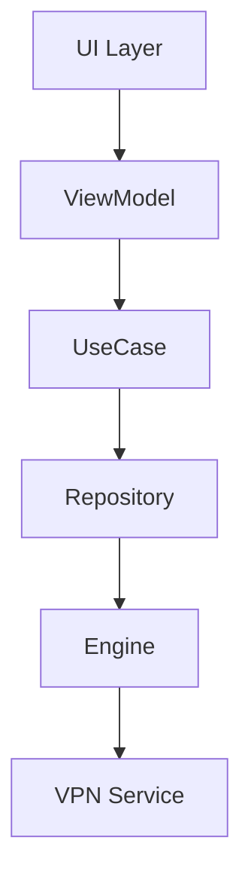
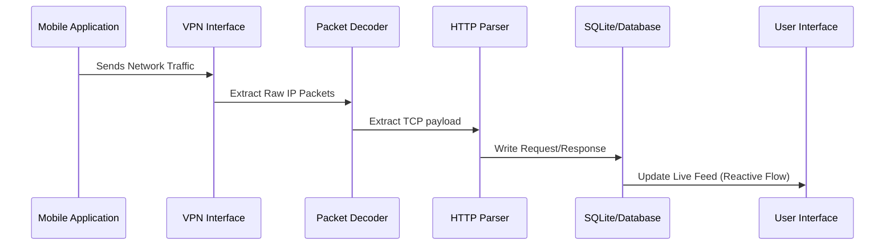
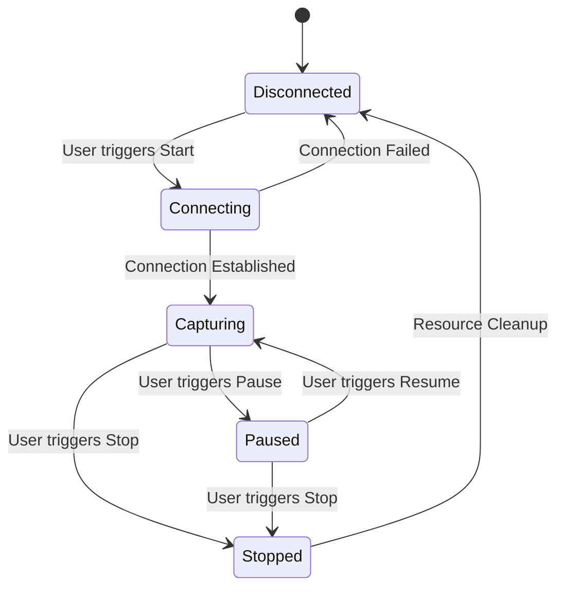
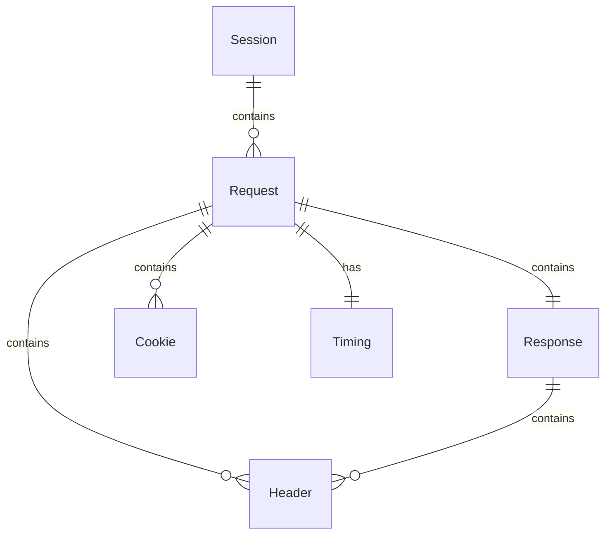
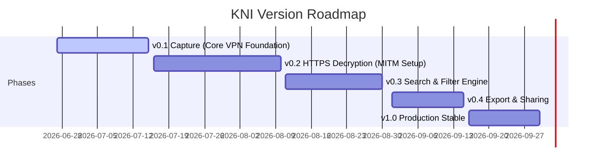
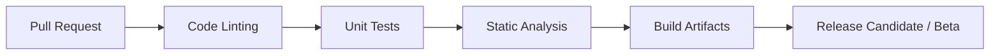

# Engineering Standards and Rules

> Kizuna Network Inspector (KNI) Development Guidelines & Standard Operating Procedures (SOP)

---

| Field | Value |
|---|---|
| Document | [00_ENGINEERING_RULES.md](file:///Users/andri/Documents/development.nosync/kizuna-network-inspector/docs/00_ENGINEERING_RULES.md) |
| Purpose | Define standard operating procedures, documentation structures, coding standards, and milestones |
| Version | 1.1.0 |
| Status | Active |
| Last Updated | 2026-06-27 |

---

## 1. Documentation Standard

Every technical specification document in this repository must follow a consistent and standardized structure:

1. **Document Metadata** (Author, Version, Status, Last Updated, etc.)
2. **Purpose** (What does this document or module achieve?)
3. **Scope** (What is in-scope and out-of-scope?)
4. **Definitions** (Key terms, acronyms, and concepts)
5. **Requirements** (Functional and Non-Functional Requirements)
6. **Architecture** (System or module architectural diagram)
7. **Components** (Detailed breakdown of modules or classes)
8. **Data Models** (Database schemas, models, or payloads)
9. **Sequence Diagrams** (Interaction and communication patterns)
10. **State Diagrams** (State transitions and lifecycle)
11. **Implementation Notes** (Technical details, library usages, algorithms)
12. **Acceptance Criteria** (Verification lists)
13. **Future Improvements** (Deferred features or improvements)

---

## 2. Requirement Strategy

### Requirement IDs
To ensure traceability across the design, code, and test suites, all requirements must be assigned a unique ID instead of generic descriptions.

#### Example: Functional Requirement Definition

| Field | Value / Description |
|---|---|
| **ID** | `FR-001` |
| **Title** | Global Search |
| **Priority** | Critical |
| **Description** | The application shall support searching across all captured requests. |
| **Acceptance Criteria** | <ul><li>[ ] Search by URL</li><li>[ ] Search by Header keys/values</li><li>[ ] Search by Request/Response Body</li><li>[ ] Support Regex search</li></ul> |
| **Dependencies** | Storage Engine, Search Engine |
| **Related Requirements** | `FR-008`, `FR-025` |

---

## 3. Non-Functional Requirements (NFR)

Every release must satisfy the baseline non-functional criteria defined below:

| ID | Category | Target Metric / Constraint | Description |
|---|---|---|---|
| **NFR-001** | Startup Time | `< 2 seconds` | Cold start to main screen capability |
| **NFR-002** | Memory Usage | `< 300 MB` baseline | Baseline footprint during idle capturing |
| **NFR-003** | Database Capacity | `100,000 requests` | Able to handle large volumes without performance decay |
| **NFR-004** | Search Latency | `< 100 ms` response time | Matches FTS index query latency |
| **NFR-005** | UI Performance | Smooth scroll at `60 / 120 FPS` | Target refresh rate on support screens |

---

## 4. Specification Guidelines

### Every Module Specification
When specifying a module (e.g., `Capture Engine`), include the following sections:
- **Purpose**: High-level explanation.
- **Responsibilities**: Clear list of what the module does.
- **Interfaces**: Public APIs, methods, or protocols.
- **Thread Model**: Coroutine dispatchers, thread safety details.
- **Sequence Diagram**: Visual interactions.
- **Failure Handling**: How exceptions and boundary conditions are handled.
- **Configuration**: Initialization options and customizable flags.
- **Future Extension**: Design hooks for anticipated enhancements.

### Every Screen Specification
When specifying a UI screen (e.g., `Live Capture Screen`), include the following sections:
- **Purpose**: Why the screen exists.
- **Navigation**: Incoming and outgoing transitions.
- **Components**: UI blocks (e.g., Toolbar, Actions).
- **States**: Detail the look and behavior for the following states:
  - `Loading`
  - `Empty`
  - `Capturing`
  - `Paused`
  - `Error`
- **User Flow**: Action-by-action steps.
- **Acceptance Criteria**: Verify UI interactions.

### Every Object Specification
Avoid generic or loose names (e.g., use `RequestSession` instead of `Request`). Detail:
- **Fields**: Data types, descriptions.
- **Validation**: Rules for inputs.
- **Nullable**: Clearly mark nullable fields.
- **Constraints**: Constraints like unique, range, length.
- **Indexes**: Database indexes for performance.
- **Relationships**: Foreign keys and cardinalities.
- **Serialization**: Formats (JSON, Protobuf, etc.).
- **Migration Notes**: How to handle schema upgrades.

---

## 5. Architectural & System Diagrams

To maintain consistency, all diagrams should be represented using Mermaid syntax where possible.

### Architecture Layer Flow
This diagram illustrates the clean flow of control and dependency layers:



### Packet Processing Sequence Flow
The execution sequence from network packet extraction to UI update:



### VPN Connection State Machine
The lifecycle transitions of the network inspector engine:



### Entity-Relationship Diagram (ERD)
The underlying database entity mapping:



---

## 6. Development & Coding Standards

A comprehensive coding standard must cover:

### 1. Naming Conventions
- **Classes/Types**: `PascalCase` (e.g., `CaptureSession`, `HttpDecoder`).
- **Variables/Functions**: `camelCase` (e.g., `startCapture()`, `activeConnectionCount`).
- **Native Bindings/DB Columns**: `snake_case` (e.g., `session_id`, `packet_len`).

### 2. Package Structure
- **Domain-Driven Design (DDD)**: Group folders by capability layers (`capture`, `storage`, `search`) rather than technical types (`adapters`, `helpers`).

### 3. Module Rules
- High cohesion, low coupling, no circular dependencies.
- Implement explicit API visibility boundaries using `internal` keywords in Kotlin.

### 4. Dependency Rules
- The domain layer must be pure and have no dependencies on UI frameworks (Compose / SwiftUI) or platform integrations (Android Context, iOS SDKs).

### 5. Error Handling
- Use structured Rust `Result<T, E>` and Kotlin `Result<T>` wrappers.
- Never write empty catch blocks (`catch (e: Exception) {}`).

### 6. Logging Standards
- All logs must use configured platform loggers (e.g., Timber on Android).
- Log categories must match levels: `Verbose`, `Debug`, `Info`, `Warn`, `Error`.
- Production builds must automatically strip debug logs and mask credentials in warning logs.

### 7. Coroutines & Flows
- Always inject Dispatchers (`Dispatchers.IO`, `Dispatchers.Default`) into classes instead of hardcoding them.
- Avoid using `GlobalScope`. Use structured concurrency scopes tied to lifecycles (`viewModelScope`, custom resource scopes).

---

## 7. Native Interoperability Rules (JNI / FFI)

Since KNI bridges native Rust code with JVM (Kotlin) and Apple (Swift) environments, the following rules apply to JNI/FFI boundaries:

1. **Explicit Memory Control**: Any raw buffer allocated in Rust and passed to Kotlin/Swift must be explicitly freed. Implement a `destroy()` function to release pointers.
2. **Crash Prevention**: Rust code must never panic across the FFI boundary. Use catch-unwind blocks to return a structured error result to JVM/Swift.
3. **Data Serialization**: Pass complex data models using lightweight formats (e.g., CBOR or Protobuf byte arrays) instead of individual JNI fields to optimize serialization latency.

---

## 8. Milestones & Planning

Avoid arbitrary definitions like "MVP". Instead, structure development around concrete, measurable Milestones.

### Milestone Template

```markdown
### Milestone [Number]: [Title]
- **Deliverables**: list of features/components (e.g., VPN Skeleton, Database setup)
- **Success Criteria**: measurable thresholds
- **Estimated Duration**: start to finish target
- **Risks & Mitigations**: identified blockers
```

### Proposed Version Roadmap



---

## 9. Security Strategy

Security must have a dedicated design specification addressing:
- **Certificate Storage**: Secure generation, injection, and rotation of user CA certificates inside KeyStore/Keychain.
- **MITM Protection**: Bind socket listeners only to localhost (`127.0.0.1`) to prevent external interception.
- **Privacy Controls**: Strict rules preventing transmission of decrypted network payloads off the device.
- **Encryption**: At-rest database encryption for sensitive network data.

---

## 10. QA & Test Coverage

Each software module must specify:
1. **Unit Tests**: Pure business logic verification.
2. **Integration Tests**: Component boundary and database tests.
3. **Performance Tests**: Memory leak detection and CPU profiling.
4. **Stress Tests**: Behavior under high load (packet overload, multiple connections).
5. **Compatibility Tests**: Android API level and OS vendor variance compatibility.

---

## 11. CI/CD Lifecycle

