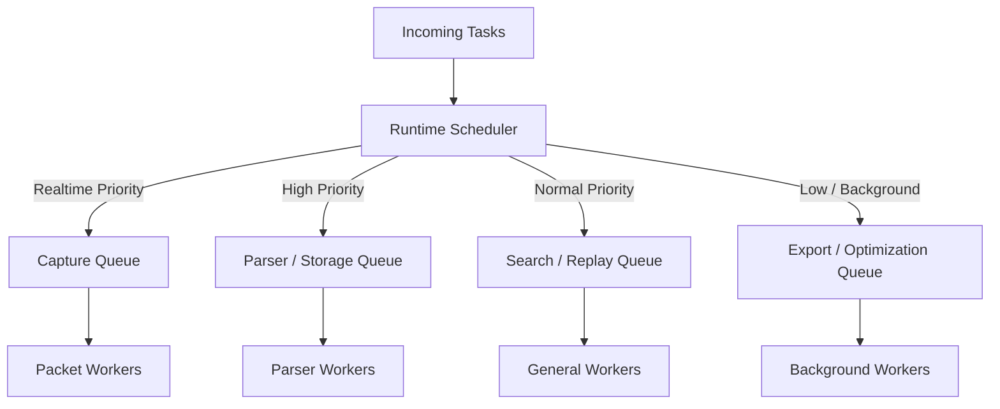
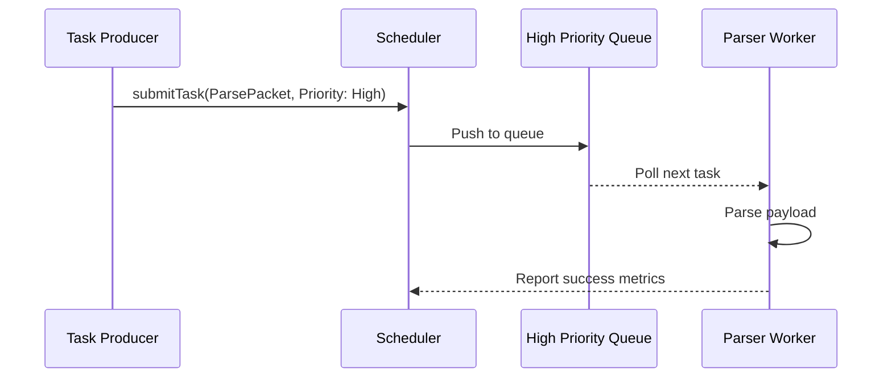
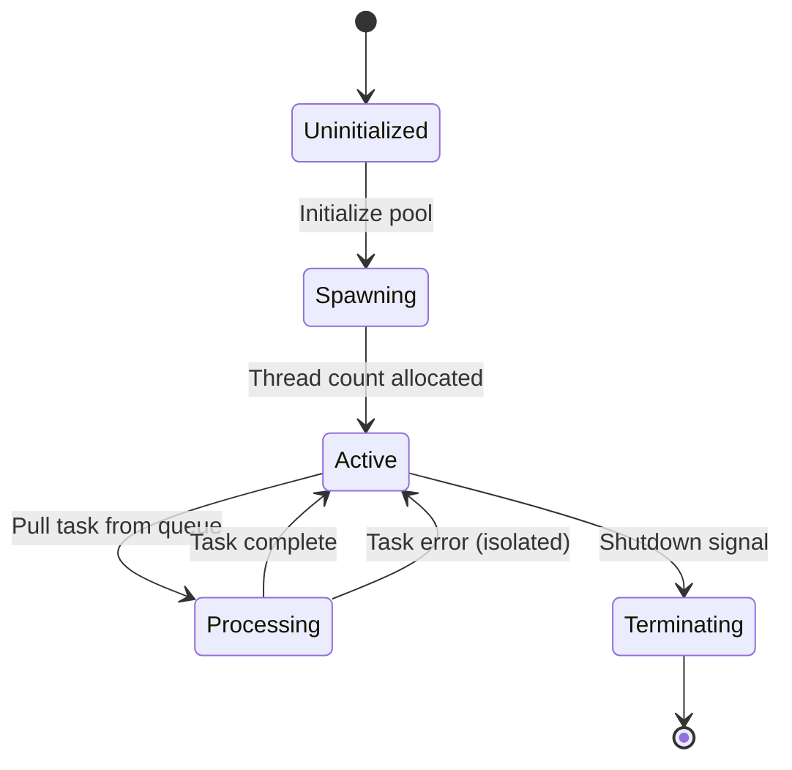

# 11_RUNTIME_EXECUTION_MODEL.md

> Project: Kizuna Network Inspector
>
> Parent:
> [00_MASTER_SPEC.md](file:///Users/andri/Documents/development.nosync/kizuna-network-inspector/docs/00_MASTER_SPEC.md)
>
> Version: 1.0
>
> Status: Draft
>
> Document Type:
> Runtime Execution Model Specification

---

## 1. Document Metadata

| Field | Value |
|---|---|
| Document | [11_RUNTIME_EXECUTION_MODEL.md](file:///Users/andri/Documents/development.nosync/kizuna-network-inspector/docs/11_RUNTIME_EXECUTION_MODEL.md) |
| Author | Kizuna Network Inspector Core Team |
| Version | 1.0.0-draft |
| Status | Draft |
| Target Platform | Runtime Scheduling Subsystem |
| Last Updated | 2026-06-27 |

---

## 2. Purpose

This document defines how the Runtime executes work, specifying scheduling, execution, concurrency, prioritization, synchronization, and fault isolation mechanisms. It establishes the execution lifecycle for Runtime Systems without defining specific business logic.

---

## 3. Scope

### In-Scope
- Scheduling queues and their priorities.
- Concurrency workers allocation and pools.
- Backpressure behaviors for slow database or search consumers.
- Fault isolation rules preventing cascading system failures.
- System communication, metrics, and cancellation models.

### Out-of-Scope
- UI main thread loop management (handled by platform-specific clients).

---

## 4. Definitions

- **Runtime System**: An isolated executor representing one backend capability (e.g. `StorageSystem`).
- **Scheduler**: The central component coordinating CPU worker threads and prioritizations.
- **Backpressure**: The strategy applied when incoming observation queues fill up faster than they can be consumed.
- **Worker Pool**: A dedicated group of threads allocated to process tasks of a specific queue.

---

## 5. Requirements

### Functional Requirements

| ID | Title | Priority | Description | Acceptance Criteria |
|---|---|---|---|---|
| **RX-001** | Priority Queues | Critical | Organize scheduler work into distinct priority queues. | <ul><li>[ ] Realtime, High, Normal, Low queues</li><li>[ ] Capture receives highest priority</li></ul> |
| **RX-002** | Backpressure Control | Critical | Protect memory when storage blocks; drop non-critical tasks rather than stalling packet captures. | <ul><li>[ ] Never block TUN interfaces</li><li>[ ] Buffer limits enforced</li></ul> |
| **RX-003** | Fault Isolation | High | Failure in one system must not affect capture or parsing stability. | <ul><li>[ ] Catch exceptions at system boundaries</li><li>[ ] Isolate panic impacts</li></ul> |

### Non-Functional Requirements

- **Determinism**: Given identical input, Systems MUST produce identical output. Execution order must be deterministic where ordering affects correctness.
- **Thread Safety**: All Runtime Systems MUST be thread-safe. COM objects MUST remain immutable. No shared mutable state between Systems.

---

## 6. Architecture (Scheduling Engine)

The Runtime does not execute features; it schedules Systems. Every capability is implemented as an independent Runtime System.

```text
Application
     │
     ▼
  Runtime
     │
     ▼
Runtime Scheduler
     │
     ▼
Runtime Systems
     │
     ▼
Canonical Observation Model
```

### Execution Pipeline Flow



### Pipelines Block Diagram
`Producer → CaptureSystem → TransportSystem → TlsSystem → ProtocolSystem → NormalizationSystem → StorageSystem → SearchSystem → Consumers`

---

## 7. Components

- **`RuntimeScheduler`**: Evaluates thread queues, schedules jobs, and manages resource load balancing.
  - *Responsibilities*: Queue management, Thread allocation, Priorities, Cancellation, Retries, Metrics, Load balancing.
- **`WorkerPools`**: Separate thread groups optimized for different tasks.
  - *Dedicated Pools*: Packet Workers, Parser Workers, Storage Workers, Search Workers, Export Workers, Compression Workers. (Workers never execute UI code).
- **`BackpressureController`**: Monitors queue depths and applies discard or stream-throttle decisions.
- **`SystemRegistry`**: Registers active runtime systems, managing their lifecycle and boundaries.

---

## 8. Data Models

### Runtime Systems List

The Core Systems managed by the scheduler include:
1. `CaptureSystem`
2. `TransportSystem`
3. `TlsSystem`
4. `ProtocolSystem`
5. `NormalizationSystem`
6. `StorageSystem`
7. `SearchSystem`
8. `ExportSystem`
9. `ReplaySystem`
10. `StatisticsSystem`
11. `DiagnosticsSystem`
12. `ConfigurationSystem`
13. `CertificateSystem`

### Scheduling Queues Structure

| Queue Type | Handled Systems | Priority Level |
|---|---|---|
| **Realtime Queue** | Capture | Highest |
| **High Priority Queue** | TLS, Parser, Storage | High |
| **Normal Queue** | Search, Statistics, Replay | Normal |
| **Low Priority Queue** | Export, Diagnostics | Low |
| **Background Queue** | Compression, Cleanup, Index Optimization | Background / Idle |

### System Principles
Every System must follow:
- Have one responsibility.
- Receive immutable input.
- Produce immutable output.
- Be independently testable.
- Be replaceable.
- Be observable.

---

## 9. Sequence Diagrams

### Task Execution Sequence



---

## 10. State Diagrams

### Worker Thread Pool Lifecycle



---

## 11. Implementation Notes

### Backpressure Rules
When incoming observations exceed processing capacity:
- Capture always wins.
- Export may pause.
- Replay may pause.
- Statistics may skip intermediate updates.
- Diagnostics continue.
- **The Runtime must never block packet capture because of slow consumers.**

### Fault Isolation
Each System is isolated to prevent cascading crashes:
- Failure in `ExportSystem` has no effect on `CaptureSystem`.
- Failure in `StatisticsSystem` has no effect on `StorageSystem`.
- Failure in `ReplaySystem` does not interrupt active captures.

### Synchronization
Shared mutable state is strictly prohibited. Communication occurs through:
- Immutable COM objects.
- Runtime events.
- Thread-safe queues.

### Cancellation
Long-running tasks (Export, Replay, Search, Index rebuild) must support cancellation. Cancellation never corrupts stored observations.

### Recovery
- Recoverable failures are automatically retried.
- Fatal failures are reported immediately.
- Systems continue operating where possible.

### Metrics Exponent
Every System publishes the following performance counters:
- Execution time
- Queue depth
- Failure count
- Success count
- Latency
- Throughput
- Memory usage

### Dynamic Registration
Future Systems (such as `Http3System`, `GrpcSystem`, `PluginSystem`, `AISystem`) register at Runtime startup without requiring core modification.

### Execution Invariants
- Scheduler owns execution.
- Systems own processing.
- Runtime owns lifecycle.
- COM owns data.
- Consumers never modify COM.
- Producer ordering is preserved.

---

## 12. Acceptance Criteria

- [ ] Capture tasks execute with zero scheduler queuing latency even during heavy database migrations.
- [ ] Throwing a panic inside the `ExportSystem` does not crash the capture flow.
- [ ] Memory utilization stays stable under max queue backpressures.
- [ ] Task scheduling remains fully-deterministic where causal ordering is required.

---

## 13. Future Improvements

- **Work Stealing Schedulers**: Implement specialized work-stealing algorithms to optimize core balances on multi-core processors.
- **Dynamic Thread Scaling**: Dynamically expand and shrink worker pool counts based on active capturing packet rates.
- **Execution support**: Establish Distributed Runtime, Remote Workers, GPU Analysis, Streaming AI, and Cloud Synchronization without redesigning the core execution loops.

---

## 14. References

- [04_PLATFORM_KERNEL.md](file:///Users/andri/Documents/development.nosync/kizuna-network-inspector/docs/04_PLATFORM_KERNEL.md)
- [08_NETWORK_OBSERVATION_MODEL.md](file:///Users/andri/Documents/development.nosync/kizuna-network-inspector/docs/08_NETWORK_OBSERVATION_MODEL.md)
- [09_OBSERVATION_PIPELINE.md](file:///Users/andri/Documents/development.nosync/kizuna-network-inspector/docs/09_OBSERVATION_PIPELINE.md)
- [10_RUNTIME_CONTRACT.md](file:///Users/andri/Documents/development.nosync/kizuna-network-inspector/docs/10_RUNTIME_CONTRACT.md)