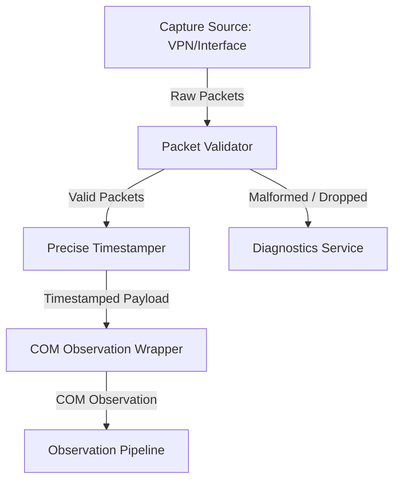
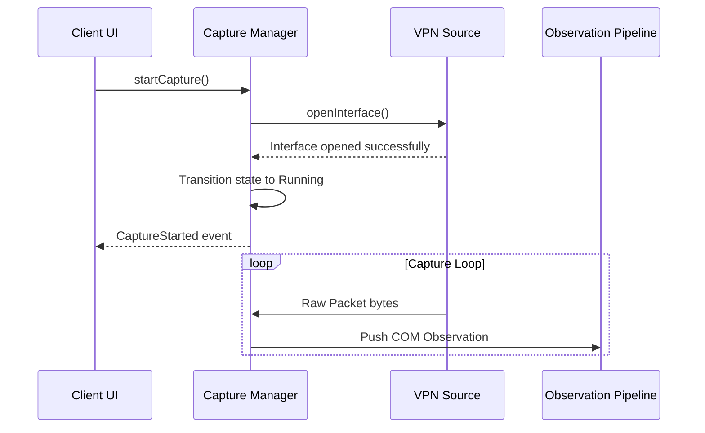
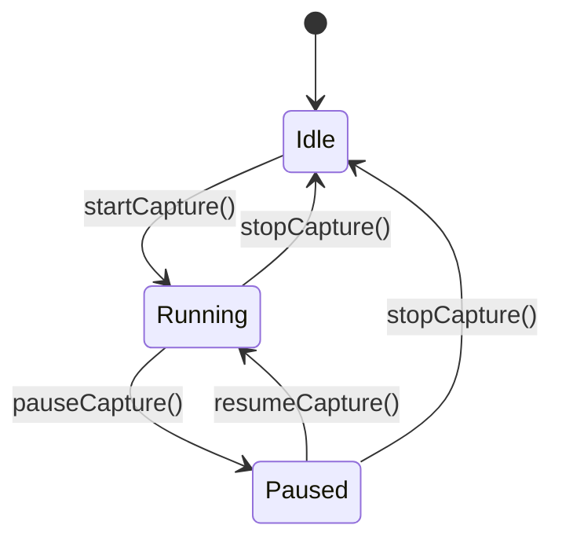

# 12_CAPTURE_ENGINE.md

> Project: Kizuna Network Inspector
>
> Parent:
> [00_MASTER_SPEC.md](file:///Users/andri/Documents/development.nosync/kizuna-network-inspector/docs/00_MASTER_SPEC.md)
>
> Version: 1.0
>
> Status: Draft
>
> Document Type:
> Capture Engine Specification

---

## 1. Document Metadata

| Field | Value |
|---|---|
| Document | [12_CAPTURE_ENGINE.md](file:///Users/andri/Documents/development.nosync/kizuna-network-inspector/docs/12_CAPTURE_ENGINE.md) |
| Author | Kizuna Network Inspector Core Team |
| Version | 1.0.0-draft |
| Status | Draft |
| Target Platform | Capture Orchestration Subsystem |
| Last Updated | 2026-06-27 |

---

## 2. Purpose

The Capture Engine collects network traffic from supported capture sources and converts it into the [Canonical Observation Model (COM)](file:///Users/andri/Documents/development.nosync/kizuna-network-inspector/docs/08_NETWORK_OBSERVATION_MODEL.md). It is the sole component responsible for acquiring raw network traffic.

---

## 3. Scope

### In-Scope
- Orchestrating start, pause, resume, and stop actions for packet capture.
- Validating packets (IPv4/IPv6 length checks, type verification).
- Timestamping raw network frames and packaging them as COM observations.
- Maintaining capture session metadata.
- Processing multiple capture sources (Android VPNService, proxies, file imports).

### Out-of-Scope
- Deep packet inspection (TCP/UDP, TLS, or HTTP decoding is delegated to downstream engines).
- Platform-level permission management (handled by native UI clients).

---

## 4. Definitions

- **Capture Source**: A system interface providing network streams (e.g., Android VPN interface, PCAP file, local proxy socket).
- **Observation Wrapper**: The mapping component transforming raw system bytes into COM-compliant records.

---

## 5. Requirements

### Functional Requirements

| ID | Title | Priority | Description | Acceptance Criteria |
|---|---|---|---|---|
| **CP-001** | Capture Controls | Critical | Support start, stop, pause, and resume actions dynamically. | <ul><li>[ ] Operations complete under 500ms</li><li>[ ] State events emitted</li></ul> |
| **CP-002** | Raw Packet Validation | Critical | Filter and validate incoming frames before wrapping. | <ul><li>[ ] Discard truncated IP packets</li><li>[ ] Support IPv4/IPv6</li></ul> |
| **CP-003** | Accurate Timestamping | High | Attach precise UTC and monotonic offsets to observations. | <ul><li>[ ] Precision under 1 microsecond</li></ul> |

### Non-Functional Requirements
- **Capture Latency**: `< 1 ms`
- **Queue Latency**: `< 2 ms`
- **Packet Throughput**: `≥ 100,000 packets/sec`
- **Dropped Packets**: `< 0.01% under normal load`

---

## 6. Architecture (Capture Flow)



### Pipelines Block Diagram
`Capture Source → Capture Engine → Packet Queue → Transport Processor`

---

## 7. Components

- **`CaptureManager`**: Core coordinator managing the lifecycle states of capture.
  - *Public Operations*: `initialize()`, `startCapture()`, `pauseCapture()`, `resumeCapture()`, `stopCapture()`, `shutdown()`.
- **`PacketValidator`**: Performs boundaries and size checks on IP buffers.
- **`ObservationWrapper`**: Converts raw arrays and platform details into COM elements.
- **`CaptureStatsCollector`**: Tracks metrics like bytes/sec and dropped packet counts.

---

## 8. Data Models

### Capture Session Properties

```rust
struct CaptureSessionInfo {
    session_id: Uuid,
    start_time_utc: u64,
    device_model: String,
    os_version: String,
    capture_source_type: String, // e.g. "AndroidVpn"
}
```

### Supported Protocols
- **Layer 3**: IPv4, IPv6
- **Layer 4**: TCP, UDP, ICMP (future)
*Note: Unsupported protocols shall be ignored gracefully.*

---

## 9. Sequence Diagrams

### Start Capture Flow



---

## 10. State Diagrams

### Capture Engine Lifecycle



---

## 11. Implementation Notes

### Responsibilities Allocation
- **Engine SHALL**: Start, Stop, Pause, and Resume capture; Receive packets; Preserve packet ordering; Timestamp packets; Assign CaptureSession; Forward packets to downstream processors; Publish runtime events; Collect capture statistics.
- **Engine SHALL NOT**: Parse HTTP; Parse TLS; Search observations; Store observations; Export observations; Modify UI.

### Packet Processing Flow
`Raw Packet → Timestamp → Assign CaptureSession → Validate → Wrap as Observation → Publish`

### Packet Validation Rules
Every packet shall be validated against:
- Packet length
- IP version
- Transport protocol
- Corrupted data detection
- Capture source verification
*Invalid packets are discarded with diagnostics.*

### Buffer Management
The Capture Engine maintains bounded queues:
- Receive Buffer
- Processing Queue
- Overflow Queue

### Backpressure Rules
- **Priority**: 1. Capture, 2. Processing, 3. Storage, 4. Search, 5. Export.
- If buffers become full: Slow consumers may drop processing work; Capture must continue whenever possible.

### Statistics Exposed
- Total packets, Packets/sec, Bytes/sec, Dropped packets, Invalid packets, Active connections, Capture duration.

### Diagnostics Exposed
- Queue depth, Worker state, Active interface, Packet rate, Buffer usage, Capture status.

### Threading Model
Capture must never execute on the UI thread. It runs across:
- Capture Thread
- Packet Queue Worker
- Event Dispatcher

### Security Rules
- Never transmit packets externally.
- Respect platform permissions.
- Isolate capture memory.
- Zero sensitive buffers when released.

### Dependencies
- **Depends on**: Runtime, Scheduler, Observation Pipeline.
- **Does NOT depend on**: UI, Search, Export, Replay.

---

## 12. Acceptance Criteria

### Verification Tests
- **Unit Tests**: Lifecycle, Validation, Ordering, Buffer overflow, Error handling.
- **Integration Tests**: VPN capture, Packet forwarding, High traffic, Long duration capture.
- **Performance Tests**: Sustained throughput, Memory usage, Queue latency.

### Core Acceptance Criteria
- [ ] VPN traffic is captured successfully.
- [ ] Packets are timestamped (including Capture timestamp UTC, Monotonic timestamp, and Capture duration offset).
- [ ] Packet ordering is preserved (Ordering keys: 1. Capture timestamp, 2. Sequence number, 3. Arrival order).
- [ ] No UI blocking occurs.
- [ ] Runtime events are emitted correctly (`CaptureStarted`, `CapturePaused`, `CaptureResumed`, `CaptureStopped`, `PacketCaptured`, `PacketDropped`, `CaptureError`).
- [ ] Performance targets are met.

---

## 13. Future Improvements

- **Capture Providers**: Expand to Local HTTP Proxy, SOCKS Proxy, PCAP Import, HAR Import, Remote Agent, Desktop Capture, and Plugin Producers using standard `CaptureSource` contracts.
- **BPF Filtering**: Add BPF rules mapping to discard packets early in native code.

---

## 14. References

- [00_MASTER_SPEC.md](file:///Users/andri/Documents/development.nosync/kizuna-network-inspector/docs/00_MASTER_SPEC.md)
- [08_NETWORK_OBSERVATION_MODEL.md](file:///Users/andri/Documents/development.nosync/kizuna-network-inspector/docs/08_NETWORK_OBSERVATION_MODEL.md)
- [09_OBSERVATION_PIPELINE.md](file:///Users/andri/Documents/development.nosync/kizuna-network-inspector/docs/09_OBSERVATION_PIPELINE.md)
- [10_RUNTIME_CONTRACT.md](file:///Users/andri/Documents/development.nosync/kizuna-network-inspector/docs/10_RUNTIME_CONTRACT.md)
- [11_RUNTIME_EXECUTION_MODEL.md](file:///Users/andri/Documents/development.nosync/kizuna-network-inspector/docs/11_RUNTIME_EXECUTION_MODEL.md)