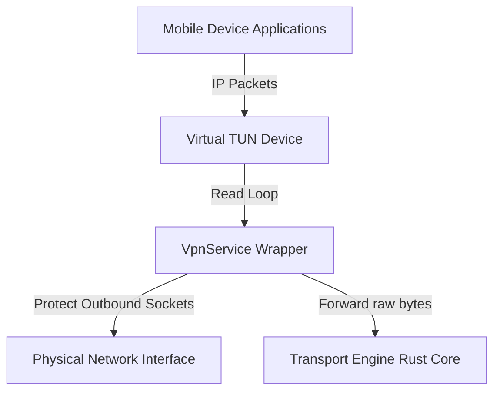
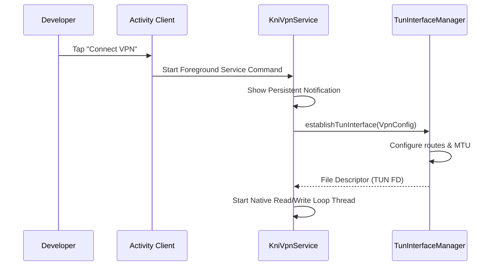
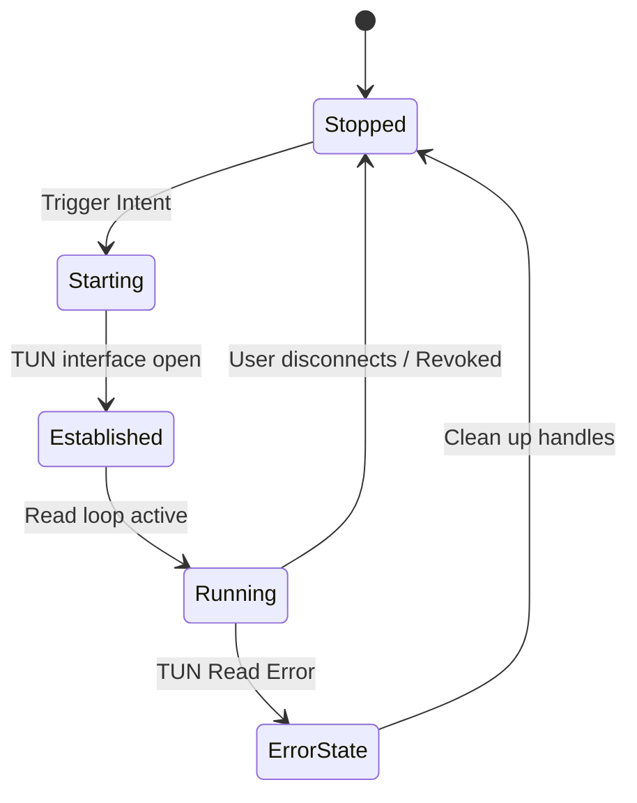

# 13_VPN_ENGINE.md

> Project: Kizuna Network Inspector
>
> Parent:
> [00_MASTER_SPEC.md](file:///Users/andri/Documents/development.nosync/kizuna-network-inspector/docs/00_MASTER_SPEC.md)
>
> Version: 1.0.1
>
> Status: Draft
>
> Document Type:
> VPN Engine Specification

---

## 1. Document Metadata

| Field | Value |
|---|---|
| Document | [13_VPN_ENGINE.md](file:///Users/andri/Documents/development.nosync/kizuna-network-inspector/docs/13_VPN_ENGINE.md) |
| Author | Kizuna Network Inspector Core Team |
| Version | 1.0.1-draft |
| Status | Draft |
| Target Platform | Android VPN Service Implementation |
| Last Updated | 2026-06-27 |

---

## 2. Purpose

The VPN Engine implements Android's `VpnService` to intercept all device network traffic without requiring root access. It reads raw IP packets from the TUN interface, decodes transport protocols, reconstructs TCP streams, and forwards network data to downstream engines.

---

## 3. Scope

### In-Scope
- Creating and managing Android `VpnService` and virtual TUN interface configurations.
- Reading packets from TUN continuously, handling partial reads and errors.
- Parsing IPv4 and IPv6 packet headers.
- Extracting TCP and UDP segments and tracking active network connections.
- Reassembling TCP segments into an ordered byte stream, handling out-of-order packets and retransmissions.
- Intercepting and forwarding DNS traffic.

### Out-of-Scope
- Decrypting TLS payloads (delegated to [15_TLS_ENGINE.md](file:///Users/andri/Documents/development.nosync/kizuna-network-inspector/docs/15_TLS_ENGINE.md)).
- Storing transactions or providing UI interactions.

---

## 4. Definitions

- **VpnService**: The base Android service class allowing applications to run custom VPN solutions.
- **TUN Interface**: A virtual network kernel interface facilitating raw IP packet read and write routines.
- **Connection Tracker**: The tracker monitoring network endpoints and lifecycles.

---

## 5. Requirements

### Functional Requirements

| ID | Title | Priority | Description | Acceptance Criteria |
|---|---|---|---|---|
| **VP-001** | TUN Interface creation | Critical | Establish virtual network device with configured MTU and route settings. | <ul><li>[ ] Successful interface binding</li><li>[ ] Split tunneling operational</li></ul> |
| **VP-002** | Android VpnService bind | Critical | Integrate with platform VpnService and manage lifecycle states. | <ul><li>[ ] Bind to foreground service</li><li>[ ] Foreground notification active</li></ul> |
| **VP-003** | Local Socket Exclusions | High | Exempt KNI's outbound sockets from routing loops. | <ul><li>[ ] Use `VpnService.protect()`</li><li>[ ] Prevent routing feedback loops</li></ul> |

### Non-Functional Requirements
- **Packet Read Latency**: `< 1 ms`
- **TCP Reassembly Latency**: `< 5 ms`
- **Connection Lookup Complexity**: `O(1)` average lookup time.
- **Memory Overhead**: `< 8 KB` per connection.

---

## 6. Architecture (VPN Interface Engine)



### Pipelines Block Diagram
`Android VpnService → TUN Interface → Packet Reader → IP Parser → TCP / UDP Parser → Connection Tracker → TCP Stream Reassembler → TLS Engine`

---

## 7. Components

- **`KniVpnService`**: Platform service class inheriting from `android.net.VpnService`.
  - *Android Components utilized*: `VpnService`, `Builder`, `ParcelFileDescriptor`, `TUN Interface`, `Foreground Service`, `Notification`.
- **`TunInterfaceManager`**: Creates and closes `ParcelFileDescriptor` interfaces.
- **`PacketReader`**: Reads packets continuously, preserves packet order, timestamps packets, handles partial reads, and recovers from transient errors.
- **`IPParser`**: Parses IPv4 and IPv6 packets extracting: Source IP, Destination IP, Protocol, Length, TTL / Hop Limit.
- **`TcpUdpParser`**: Decodes:
  - *TCP Fields*: Source/Destination Port, Sequence/Acknowledgment Number, Window Size, Payload, and Flags (`SYN`, `ACK`, `FIN`, `RST`, `PSH`, `URG`).
  - *UDP Fields*: Source/Destination Port, Length, Payload.
- **`ConnectionTracker`**: Manages unique connections: Connection ID, Source/Destination Endpoints, Protocol, State (`NEW`, `SYN_SENT`, `ESTABLISHED`, `FIN_WAIT`, `CLOSE_WAIT`, `CLOSED`, `RESET`), Start Time, Last Activity, and Statistics.
- **`TcpStreamReassembler`**: Reorders packets, handles retransmissions, merges payloads, and detects stream completion. Output is an ordered byte stream.
- **`DnsHandler`**: Forwards DNS traffic, preserves DNS packets, and supports IPv4/IPv6 DNS. (Future: DNS over HTTPS, DNS over TLS).
- **`PacketForwarder`**: Dispatches output to TLS Engine, Diagnostics, and Statistics, preserving ordering.

---

## 8. Data Models

### VPN Configurations

```rust
struct VpnConfig {
    mtu: u32,
    dns_servers: Vec<String>,
    routes: Vec<String>, // e.g. "0.0.0.0/0"
    allowed_apps: Vec<String>, // Package IDs for split tunneling
    disallowed_apps: Vec<String>,
}
```

### Statistics Exposed
- Active Connections, Total Connections, TCP Connections, UDP Connections, Bytes Received/Sent, Packets Received/Dropped.

---

## 9. Sequence Diagrams

### VPN Connection Setup



---

## 10. State Diagrams

### VPN Lifecycle Machine



---

## 11. Implementation Notes

### JNI & FFI Native Interoperability Rules
To prevent memory leaks and crashes at the Kotlin-Rust boundary (per [00_ENGINEERING_RULES.md](file:///Users/andri/Documents/development.nosync/kizuna-network-inspector/docs/00_ENGINEERING_RULES.md) Section 7):

#### Rust FFI Declarations (`extern "C"`)
```rust
#[no_mangle]
pub unsafe extern "C" fn vpn_engine_init(tun_fd: i32) -> *mut VpnEngine;

#[no_mangle]
pub unsafe extern "C" fn vpn_engine_free(engine: *mut VpnEngine);

#[no_mangle]
pub unsafe extern "C" fn vpn_engine_read_packets(engine: *mut VpnEngine) -> i32;
```

#### Kotlin JNI Binding Interface
```kotlin
package com.kni.platform.vpn

class NativeVpnEngine private constructor(private val nativePtr: Long) {
    companion object {
        init {
            System.loadLibrary("kni_rust_core")
        }
        fun create(tunFd: Int): NativeVpnEngine = NativeVpnEngine(vpn_engine_init(tunFd))
    }

    fun readPackets(): Int {
        return vpn_engine_read_packets(nativePtr)
    }

    fun destroy() {
        vpn_engine_free(nativePtr)
    }

    private external fun vpn_engine_init(tunFd: Int): Long
    private external fun vpn_engine_free(enginePtr: Long)
    private external fun vpn_engine_read_packets(enginePtr: Long): Int
}
```

1. **No-Panic Boundary**: Native packet processing loops must use `catch_unwind` on every packet read to prevent crashes from propagating to the JVM.
2. **Explicit Buffer Cleanup**: Raw byte arrays allocated for packet reading must be managed with explicit memory reclaim blocks. The JNI interface exposes a `releaseVpnResources()` method to free native pointer allocations when the VPN is stopped.
3. **Data Marshalling**: Statistics and connection event lists are serialized via CBOR byte buffers across the FFI boundary to maximize performance and avoid JNI lookup overheads.

### Responsibilities Allocation
- **VPN Engine SHALL**: Create and manage Android VpnService; Create TUN interface; Read packets from TUN; Parse IPv4/IPv6 packets; Parse TCP/UDP packets; Track network connections; Reassemble TCP streams; Forward transport streams; Publish connection events; Collect VPN statistics.
- **VPN Engine SHALL NOT**: Parse TLS; Parse HTTP; Store observations; Export observations; Search observations; Access UI.

### Configuration Rules
- Use TUN interface; Support IPv4 and IPv6; Support split and full tunnel; Configure DNS servers and MTU; Protect internal sockets.

### Error Handling
- **Recoverable**: Packet corruption, Temporary read failure, Queue overflow.
- **Fatal**: VPN revoked, TUN unavailable, Runtime shutdown.

### Threading Model
- Runs on dedicated worker threads: Packet Reader, Connection Tracker, Stream Reassembler, Event Dispatcher. No work shall execute on the UI thread.

### Security Rules
- Protect internal sockets; Never leak traffic; Never bypass permission model; Respect Android VPN lifecycle; Keep captured traffic local.

---

## 12. Acceptance Criteria

### Verification Tests
- **Unit Tests**: IPv4/IPv6 parsing, TCP/UDP parsing, Connection tracking, Stream reassembly.
- **Integration Tests**: VPN startup/shutdown, High throughput, Multiple simultaneous connections, Long-running capture.
- **Performance Tests**: 10,000 concurrent connections, Continuous traffic, Memory stability, Packet throughput.

### Core Acceptance Criteria
- [ ] VpnService starts successfully.
- [ ] All device traffic is intercepted.
- [ ] IPv4 and IPv6 are fully supported.
- [ ] TCP streams are correctly reassembled.
- [ ] UDP packets are processed.
- [ ] Connection tracking is accurate.
- [ ] Runtime events are emitted correctly (`VPNStarted`, `VPNStopped`, `ConnectionOpened`, `ConnectionClosed`, `PacketReceived`, `PacketDropped`, `StreamCompleted`).
- [ ] Performance targets are achieved.

---

## 13. Future Improvements

- **Fallback Providers**: Dynamic DNS resolution fallback systems.
- **Protocols Intercepts**: Future intercept support for DNS over HTTPS and DNS over TLS.

---

## 14. References

- [00_MASTER_SPEC.md](file:///Users/andri/Documents/development.nosync/kizuna-network-inspector/docs/00_MASTER_SPEC.md)
- [00_ENGINEERING_RULES.md](file:///Users/andri/Documents/development.nosync/kizuna-network-inspector/docs/00_ENGINEERING_RULES.md)
- [12_CAPTURE_ENGINE.md](file:///Users/andri/Documents/development.nosync/kizuna-network-inspector/docs/12_CAPTURE_ENGINE.md)
- [15_TLS_ENGINE.md](file:///Users/andri/Documents/development.nosync/kizuna-network-inspector/docs/15_TLS_ENGINE.md)
- [08_NETWORK_OBSERVATION_MODEL.md](file:///Users/andri/Documents/development.nosync/kizuna-network-inspector/docs/08_NETWORK_OBSERVATION_MODEL.md)
- [09_OBSERVATION_PIPELINE.md](file:///Users/andri/Documents/development.nosync/kizuna-network-inspector/docs/09_OBSERVATION_PIPELINE.md)