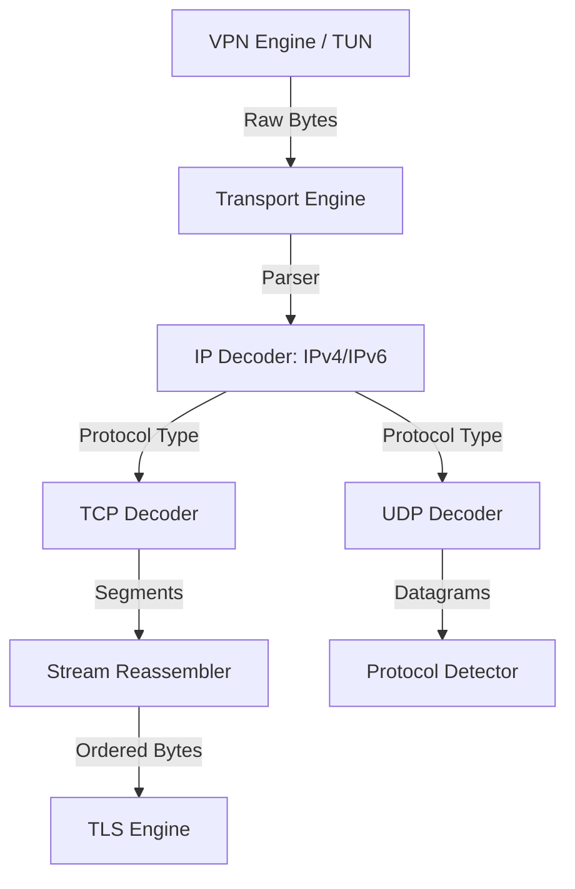
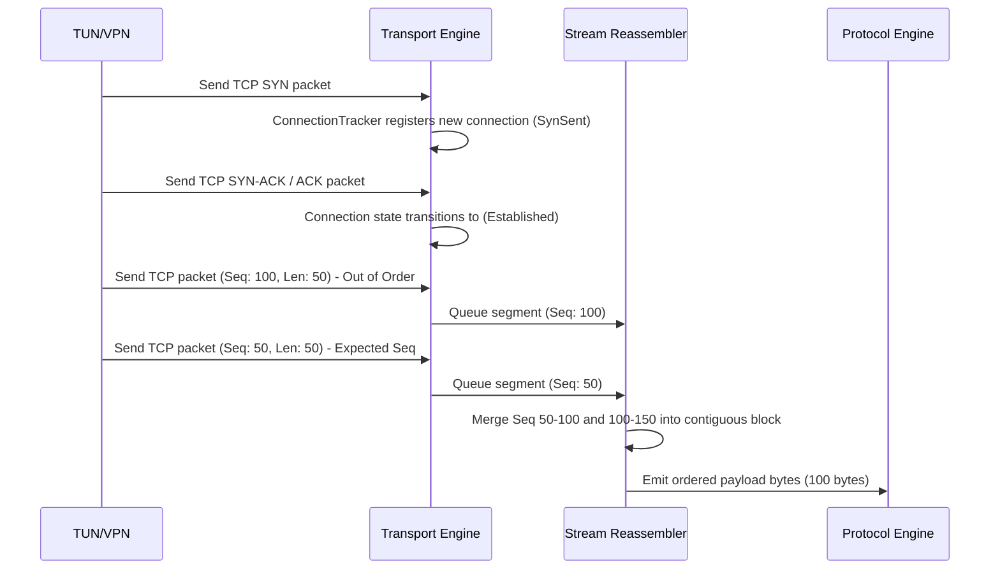
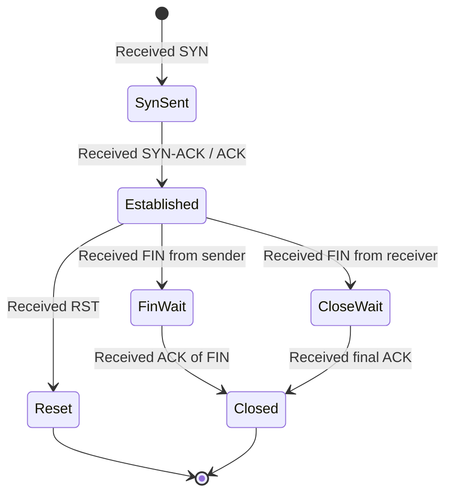

# 14_TRANSPORT_ENGINE.md

> Project: Kizuna Network Inspector
>
> Parent:
> [00_MASTER_SPEC.md](file:///Users/andri/Documents/development.nosync/kizuna-network-inspector/docs/00_MASTER_SPEC.md)
>
> Version: 1.0.1
>
> Status: Draft
>
> Document Type:
> Transport Engine Specification

---

## 1. Document Metadata

| Field | Value |
|---|---|
| Document | [14_TRANSPORT_ENGINE.md](file:///Users/andri/Documents/development.nosync/kizuna-network-inspector/docs/14_TRANSPORT_ENGINE.md) |
| Author | Kizuna Network Inspector Core Team |
| Version | 1.0.1-draft |
| Status | Draft |
| Target Platform | Rust Shared Core (Cross-platform) |
| Last Updated | 2026-06-27 |

---

## 2. Purpose

The Transport Engine is a high-performance Rust library responsible for decoding layer 3 (IPv4/IPv6) and layer 4 (TCP/UDP/QUIC) packets, tracking active network connections, and reassembling fragmented TCP streams into ordered byte sequences for application-level protocol parsing.

---

## 3. Scope

### In-Scope
- Parsing IPv4 and IPv6 headers.
- Parsing TCP segment headers and UDP datagram headers.
- Reassembling TCP segments into an ordered byte stream, handling out-of-order delivery, packet loss, and retransmissions.
- Maintaining connection tracking (stateful table of source/destination sockets).
- Demultiplexing TCP streams and UDP packets to register protocols.
- Basic UDP payload forwarding.

### Out-of-Scope
- Handling VPN interfaces directly (this is delegated to platform-specific wrappers like [13_VPN_ENGINE.md](file:///Users/andri/Documents/development.nosync/kizuna-network-inspector/docs/13_VPN_ENGINE.md)).
- TLS interception or certificate decryption (delegated to [15_TLS_ENGINE.md](file:///Users/andri/Documents/development.nosync/kizuna-network-inspector/docs/15_TLS_ENGINE.md)).
- Higher-level protocol parsing (e.g., HTTP, WebSocket).

---

## 4. Definitions

- **IP Packet**: The layer-3 packet containing source/destination IP addresses and raw payload.
- **TCP Segment**: The layer-4 transport unit including source/destination ports, sequence numbers, and flag bits (SYN, ACK, FIN, RST).
- **Stream Reassembler**: The algorithmic component that stores out-of-order TCP payloads and produces a linear stream of bytes as sequences become contiguous.
- **5-Tuple**: The unique identifier for a network stream: (Source IP, Destination IP, Source Port, Destination Port, Protocol).

---

## 5. Requirements

### Functional Requirements

| ID | Title | Priority | Description | Acceptance Criteria |
|---|---|---|---|---|
| **TR-001** | IP Header Parsing | Critical | Extract source/destination IPs, protocol type, and payload size from IPv4/IPv6 headers. | <ul><li>[ ] Support IPv4 and IPv6</li><li>[ ] Reject malformed IP headers</li></ul> |
| **TR-002** | TCP Segment Parsing | Critical | Extract ports, sequence/acknowledgment numbers, flags, and payload. | <ul><li>[ ] Decode TCP header structure</li><li>[ ] Identify SYN/FIN/RST connection flags</li></ul> |
| **TR-003** | Stream Reassembly | Critical | Maintain buffers to reorder out-of-order packets and reconstruct contiguous streams. | <ul><li>[ ] Reorder segments by sequence number</li><li>[ ] Deduplicate repeated packets</li><li>[ ] Forward contiguous data to TLS/HTTP layers</li></ul> |
| **TR-004** | UDP Parsing | High | Decode source/destination ports and datagram payloads. | <ul><li>[ ] Forward UDP datagrams without reassembly</li></ul> |
| **TR-005** | Connection Tracking | Critical | Manage connection lifecycles based on TCP state transitions. | <ul><li>[ ] Evict closed/idle connections</li><li>[ ] Support timeout limits</li></ul> |

### Non-Functional Requirements

| ID | Category | Target Metric | Description |
|---|---|---|---|
| **NTR-001** | Performance | Processing latency `< 1ms` per packet | The Rust decoding pipeline must handle streaming packets with minimal overhead. |
| **NTR-002** | Memory Efficiency | Memory overhead `< 8KB` per active connection | Ensure low memory footprint to run on mobile devices under high traffic. |

---

## 6. Architecture

The Transport Engine acts as a bridge between the raw platform-specific capture layer and the higher-level protocol stack.



---

## 7. Components

- **`IPDecoder`**: Parses IP packets, validates checksums, and handles fragmentation at the IP layer.
- **`TCPDecoder`**: Extracts TCP segments, reads sequence numbers, and manages TCP options (e.g., MSS, Window Scale).
- **`UDPDecoder`**: Processes stateless UDP packet buffers.
- **`ConnectionTracker`**: A concurrent hash map indexed by the connection 5-Tuple, managing the lifecycle and timing metrics of connections.
- **`ReassemblyBuffer`**: A memory-efficient data structure (like a B-Tree or contiguous ring-buffer) holding out-of-order segments until they can be read sequentially.

---

## 8. Data Models

### Connection 5-Tuple

```rust
struct FiveTuple {
    source_ip: IpAddr,
    dest_ip: IpAddr,
    source_port: u16,
    dest_port: u16,
    protocol: TransportProtocol, // TCP or UDP
}
```

### Connection State

```rust
enum ConnectionState {
    SynSent,
    Established,
    FinWait,
    CloseWait,
    Closed,
    Reset,
}
```

---

## 9. Sequence Diagrams

This diagram shows the sequence of packet arrival, connection state transition, stream reassembly, and payload emission.



---

## 10. State Diagrams

### Connection Tracker State Transition



---

## 11. Implementation Notes

### JNI & FFI Native Interoperability Rules
To prevent memory leaks and crashes at the Kotlin-Rust boundary (per [00_ENGINEERING_RULES.md](file:///Users/andri/Documents/development.nosync/kizuna-network-inspector/docs/00_ENGINEERING_RULES.md) Section 7):

#### Rust FFI Declarations (`extern "C"`)
```rust
#[no_mangle]
pub unsafe extern "C" fn transport_engine_new() -> *mut TransportEngine;

#[no_mangle]
pub unsafe extern "C" fn transport_engine_free(engine: *mut TransportEngine);

#[no_mangle]
pub unsafe extern "C" fn transport_engine_process_packet(
    engine: *mut TransportEngine,
    packet_buf: *const u8,
    packet_len: usize,
) -> i32; // Returns 0 on success, negative error code on panic catch
```

#### Kotlin JNI Binding Interface
```kotlin
package com.kni.platform.vpn

class NativeTransportEngine private constructor(private val nativePtr: Long) {
    companion object {
        init {
            System.loadLibrary("kni_rust_core")
        }
        fun create(): NativeTransportEngine = NativeTransportEngine(transport_engine_new())
    }

    fun processPacket(packet: ByteArray): Int {
        return transport_engine_process_packet(nativePtr, packet, packet.size)
    }

    fun destroy() {
        transport_engine_free(nativePtr)
    }

    private external fun transport_engine_new(): Long
    private external fun transport_engine_free(enginePtr: Long)
    private external fun transport_engine_process_packet(enginePtr: Long, packetBuf: ByteArray, len: Int): Int
}
```

1. **Unwind Safety**: All public JNI entrypoints (e.g. `Java_com_kni_TransportEngine_processPacket`) are wrapped with Rust's `panic::catch_unwind` to return an integer error code instead of panicking.
2. **Resource Reclaim**: Memory allocations for TCP reassembly buffers are cleared explicitly when connections close. A public FFI function `transport_engine_free(ptr)` releases the heap-allocated connection tracker references.
3. **Optimized Serialization**: Connection metrics are marshalled across the FFI using lightweight CBOR arrays to avoid JNI class-lookup overhead.

### Reassembly Algorithm
- Employs an interval tree or sorting B-Tree to track contiguous sequence ranges. Once the current sequence matches the expected sequence, the data is pushed forward into a streaming parser channel.
- **Memory Bounding**: To prevent resource exhaustion, the buffer capacity per stream is limited to 1MB. If exceeded, segments are dropped, forcing retransmissions from the source endpoint.

---

## 12. Acceptance Criteria

- [ ] Successfully parses standard IPv4 and IPv6 network packets.
- [ ] Correctly reconstructs TCP payload sequences when packets arrive out of order.
- [ ] Correctly ignores duplicate TCP packets without corrupting the reassembled output stream.
- [ ] Handles connection close flags (FIN, RST) and cleans up tracked connection references in memory.
- [ ] Unit tests cover boundary conditions, extreme fragmentation, and duplicate sequences.

---

## 13. Future Improvements

- **QUIC Stream Reconstruction**: Support tracking UDP QUIC packets and extracting QUIC streams directly.
- **Hardware Checksum Offloading**: Utilize hardware checksum validation if supported by the host OS.

---

## 14. References

- [00_MASTER_SPEC.md](file:///Users/andri/Documents/development.nosync/kizuna-network-inspector/docs/00_MASTER_SPEC.md)
- [00_ENGINEERING_RULES.md](file:///Users/andri/Documents/development.nosync/kizuna-network-inspector/docs/00_ENGINEERING_RULES.md)
- [13_VPN_ENGINE.md](file:///Users/andri/Documents/development.nosync/kizuna-network-inspector/docs/13_VPN_ENGINE.md)
- [15_TLS_ENGINE.md](file:///Users/andri/Documents/development.nosync/kizuna-network-inspector/docs/15_TLS_ENGINE.md)
