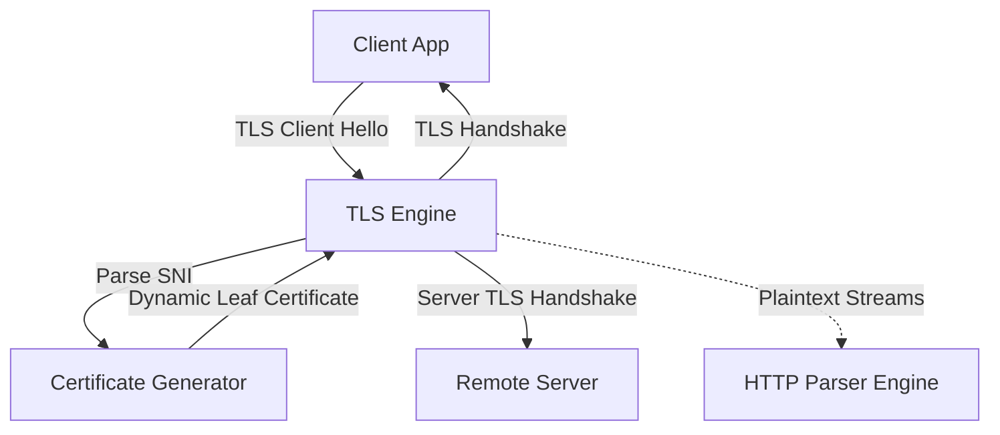
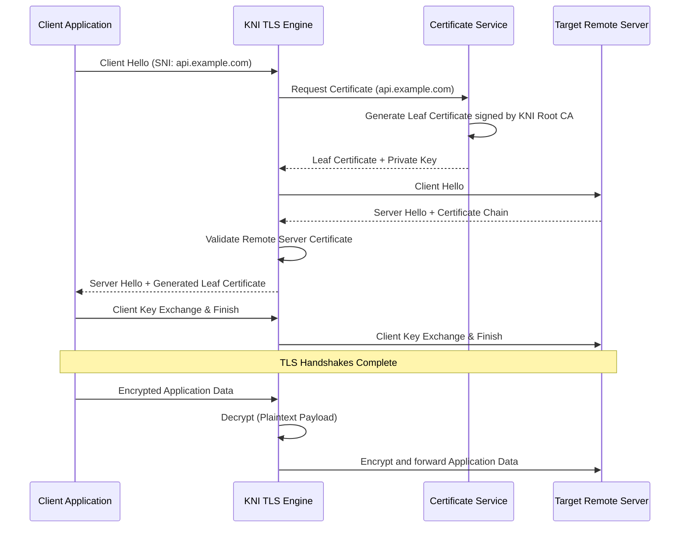
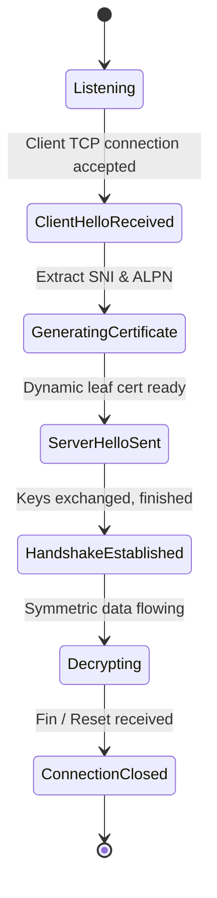

# 15_TLS_ENGINE.md

> Project: Kizuna Network Inspector
>
> Parent:
> [00_MASTER_SPEC.md](file:///Users/andri/Documents/development.nosync/kizuna-network-inspector/docs/00_MASTER_SPEC.md)
>
> Version: 1.0.1
>
> Status: Draft
>
> Document Type:
> TLS Engine Specification

---

## 1. Document Metadata

| Field | Value |
|---|---|
| Document | [15_TLS_ENGINE.md](file:///Users/andri/Documents/development.nosync/kizuna-network-inspector/docs/15_TLS_ENGINE.md) |
| Author | Kizuna Network Inspector Core Team |
| Version | 1.0.1-draft |
| Status | Draft |
| Target Platform | Rust Shared Core (Cross-platform) |
| Last Updated | 2026-06-27 |

---

## 2. Purpose

The TLS Engine is responsible for intercepts, decodes, and decrypts TLS (Transport Layer Security) traffic using Man-in-the-Middle (MITM) techniques, dynamic CA certificate generation, and secure key exchanges. It exposes plaintext payloads to downstream protocol parsers while maintaining connection security.

---

## 3. Scope

### In-Scope
- Parsing TLS Client Hello and Server Hello handshakes.
- Dynamically generating ephemeral domain certificates using a local Root CA certificate.
- Managing CA certificate storage, injection, and trust validations.
- Intercepting TLS 1.2 and TLS 1.3 streams.
- Decoding encrypted payloads and exporting decrypted application data.

### Out-of-Scope
- Bypassing strict certificate pinning implementations in target applications (requires manual system hooks or client patch scripts, out of scope for the core engine).
- Reassembling TCP packets (delegated to [14_TRANSPORT_ENGINE.md](file:///Users/andri/Documents/development.nosync/kizuna-network-inspector/docs/14_TRANSPORT_ENGINE.md)).
- Parsing HTTP/1.1 or HTTP/2 protocol specifics (delegated to subsequent engines).

---

## 4. Definitions

- **MITM (Man-in-the-Middle)**: A technique where the inspector intercepts communication between a client and server, presenting its own certificates to impersonate the host.
- **Root CA**: Root Certificate Authority, generated locally by KNI, which must be trusted by the client device to decrypt HTTPS traffic.
- **ALPN (Application-Layer Protocol Negotiation)**: A TLS extension used to negotiate the application protocol (e.g., `h2` or `http/1.1`) during the handshake.
- **SNI (Server Name Indication)**: A TLS extension indicating the hostname the client is attempting to connect to.

---

## 5. Requirements

### Functional Requirements

| ID | Title | Priority | Description | Acceptance Criteria |
|---|---|---|---|---|
| **TLS-001** | SNI Extraction | Critical | Read the client's Server Name Indication (SNI) extension from the Client Hello without decrypting the stream. | <ul><li>[ ] Extract destination hostname</li><li>[ ] Support non-SNI clients gracefully</li></ul> |
| **TLS-002** | CA Generation | Critical | Dynamically generate leaf certificates signed by the KNI Root CA for any requested host. | <ul><li>[ ] Valid subject alternative names (SAN)</li><li>[ ] Match target certificate attributes</li></ul> |
| **TLS-003** | Handshake Interception | Critical | Terminate the TLS connection from the client, and initiate a secondary TLS connection to the remote server. | <ul><li>[ ] Complete client-side TLS handshake</li><li>[ ] Complete server-side TLS handshake</li></ul> |
| **TLS-004** | Decryption & Parsing | Critical | Feed decrypted data streams into protocol parsers. | <ul><li>[ ] Expose plaintext request/response streams</li></ul> |
| **TLS-005** | Certificate Storage | High | Securely store the private key of the Root CA certificate on the platform device. | <ul><li>[ ] Store CA private key in platform KeyStore/Keychain</li></ul> |

### Non-Functional Requirements

| ID | Category | Target Metric | Description |
|---|---|---|---|
| **NTR-001** | Performance | Handshake latency `< 250ms` | Generating and signing ephemeral certificates must not cause noticeable connection delays. |
| **NTR-002** | Security | Cryptographic compliance | Must use secure ciphers, clean up keys in memory immediately after connection teardown. |

---

## 6. Architecture



---

## 7. Components

- **`TlsInterceptors`**: Intercepts the raw TCP stream buffers.
- **`HandshakeParser`**: Inspects client handshakes to extract SNI and ALPN parameters.
- **`CertificateGenerator`**: Generates and signs public/private keypairs on-the-fly using `rcgen` or native platform cryptography library.
- **`TlsDecryptor`**: Manages the dual-engine connection model (Client-to-KNI and KNI-to-Server) and performs symmetric encryption/decryption of traffic.

---

## 8. Data Models

### Ephemeral Certificate Metadata

```rust
struct EphemeralCertificate {
    hostname: String,
    serial_number: u64,
    valid_from: SystemTime,
    valid_until: SystemTime,
    public_key_pem: String,
    private_key_pem: String,
}
```

---

## 9. Sequence Diagrams



---

## 10. State Diagrams

### Interception Connection State Machine



---

## 11. Implementation Notes

### JNI & FFI Native Interoperability Rules
To prevent memory leaks and crashes at the Kotlin-Rust boundary (per [00_ENGINEERING_RULES.md](file:///Users/andri/Documents/development.nosync/kizuna-network-inspector/docs/00_ENGINEERING_RULES.md) Section 7):

#### Rust Android JNI Entrypoints (NDK Binding)
```rust
use jni::JNIEnv;
use jni::objects::{JClass, JString};
use jni::sys::{jlong, jint, jbyteArray};

#[no_mangle]
pub unsafe extern "C" fn Java_com_kni_platform_security_NativeTlsEngine_tls_1engine_1new(
    mut env: JNIEnv,
    _class: JClass,
    root_ca_pem: jbyteArray,
) -> jlong {
    let bytes = env.convert_byte_array(&root_ca_pem).unwrap();
    let engine = Box::into_raw(Box::new(TlsEngine::new(&bytes)));
    engine as jlong
}

#[no_mangle]
pub unsafe extern "C" fn Java_com_kni_platform_security_NativeTlsEngine_tls_1engine_1free(
    _env: JNIEnv,
    _class: JClass,
    engine_ptr: jlong,
) {
    if engine_ptr != 0 {
        let _ = Box::from_raw(engine_ptr as *mut TlsEngine);
    }
}

#[no_mangle]
pub unsafe extern "C" fn Java_com_kni_platform_security_NativeTlsEngine_tls_1engine_1intercept_1handshake(
    mut env: JNIEnv,
    _class: JClass,
    engine_ptr: jlong,
    connection_id: jlong,
    sni: JString,
) -> jint {
    let engine = &mut *(engine_ptr as *mut TlsEngine);
    let sni_str: String = env.get_string(&sni).unwrap().into();
    match engine.intercept_handshake(connection_id as u64, &sni_str) {
        Ok(_) => 0,
        Err(_) => -1,
    }
}
```

#### Kotlin JNI Binding Interface
```kotlin
package com.kni.platform.security

class NativeTlsEngine private constructor(private val nativePtr: Long) {
    companion object {
        init {
            System.loadLibrary("kni_rust_core")
        }
        fun create(rootCaPem: ByteArray): NativeTlsEngine {
            return NativeTlsEngine(tls_engine_new(rootCaPem))
        }
    }

    fun interceptHandshake(connectionId: Long, sni: String): Int {
        return tls_engine_intercept_handshake(nativePtr, connectionId, sni)
    }

    fun destroy() {
        tls_engine_free(nativePtr)
    }

    private external fun tls_engine_new(caPem: ByteArray): Long
    private external fun tls_engine_free(enginePtr: Long)
    private external fun tls_engine_intercept_handshake(enginePtr: Long, connId: Long, sni: String): Int
}
```

1. **Unwind Safety**: Cryptographic key exchange methods are wrapped inside Rust `catch_unwind` bounds, returning an error pointer instead of panicking on invalid client packets.
2. **Explicit Cryptographic Memory Deallocation**: Ephemeral keys are wiped in memory using `zeroize` traits immediately after handshakes or socket terminations. A public FFI endpoint `tls_engine_destroy(session_ptr)` releases all native handshake buffers.
3. **Data Passing**: TLS configuration parameters are exchanged using lightweight CBOR arrays.

### Cryptographic Engine
- Rust-native `rustls` or `openssl` interface.
- **Root CA Storage**: On Android, private keys should reside inside the Android KeyStore API. Leaf certificates are cached in-memory for 1 hour to optimize performance.
- **Root CA Trust Setup**: Developers must manually install KNI Root CA to System/User trust store, as Android 10+ restricts user-installed CAs for security. KNI will display instructions.

---

## 12. Acceptance Criteria

- [ ] Ephemeral leaf certificates match the target hostname dynamically.
- [ ] TLS Handshake successfully finishes for TLS 1.2 and 1.3 clients.
- [ ] TLS Engine validates the remote server certificate against the system trust anchors.
- [ ] Plaintext payloads are cleanly forwarded to protocol parsing layers.
- [ ] Local Root CA private key is never exposed outside the platform boundaries.

---

## 13. Future Improvements

- **ESNI/ECH Parsing**: Support for Encrypted Server Name Indication/Encrypted Client Hello when standards mature.
- **Interception Bypass Rules**: Whitelist support to forward specific hostnames without decryption (passthrough).

---

## 14. References

- [00_MASTER_SPEC.md](file:///Users/andri/Documents/development.nosync/kizuna-network-inspector/docs/00_MASTER_SPEC.md)
- [00_ENGINEERING_RULES.md](file:///Users/andri/Documents/development.nosync/kizuna-network-inspector/docs/00_ENGINEERING_RULES.md)
- [14_TRANSPORT_ENGINE.md](file:///Users/andri/Documents/development.nosync/kizuna-network-inspector/docs/14_TRANSPORT_ENGINE.md)
