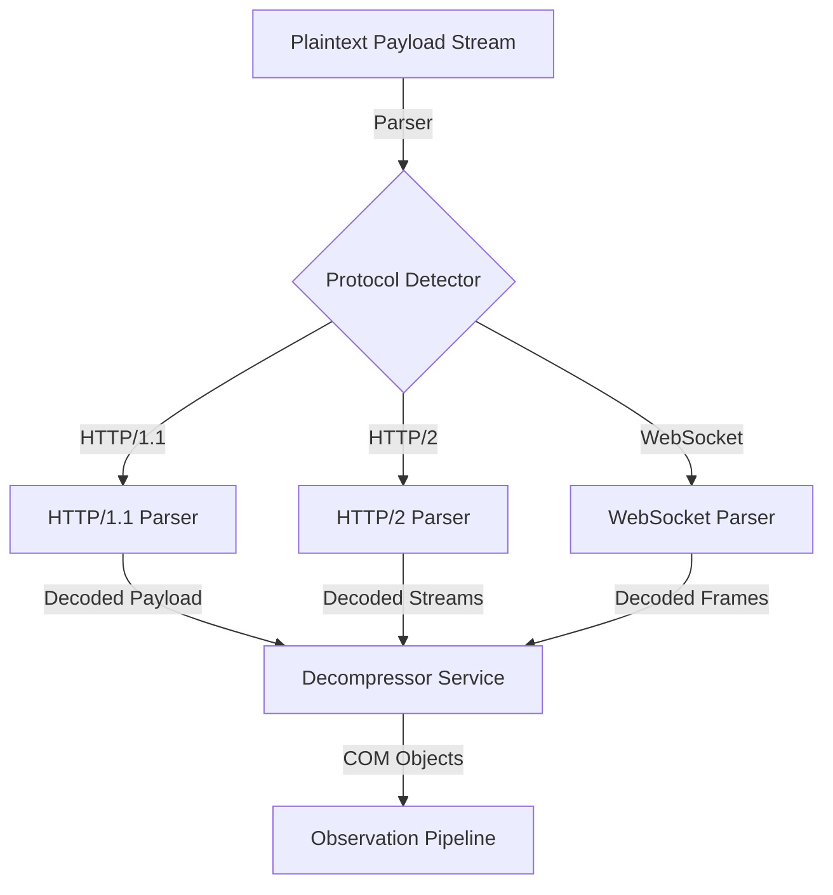
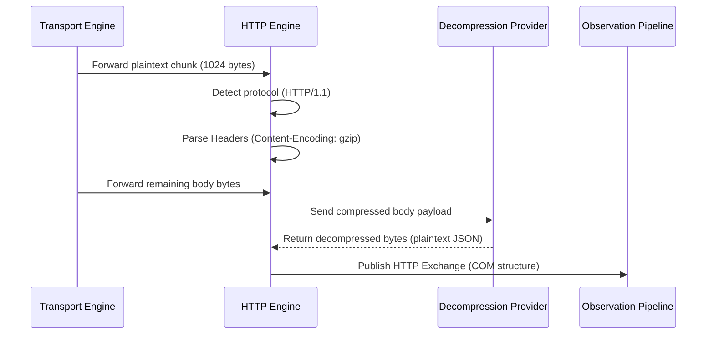
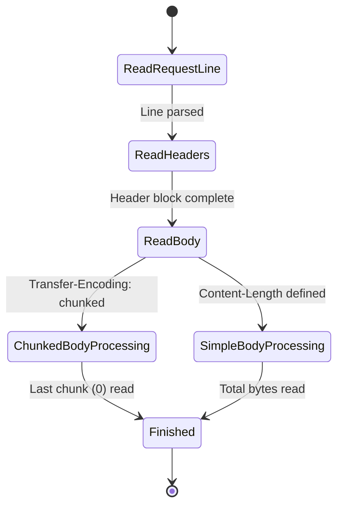

# 16_HTTP_ENGINE.md

> Project: Kizuna Network Inspector
>
> Parent:
> [00_MASTER_SPEC.md](file:///Users/andri/Documents/development.nosync/kizuna-network-inspector/docs/00_MASTER_SPEC.md)
>
> Version: 1.0.1
>
> Status: Draft
>
> Document Type:
> HTTP Engine Specification

---

## 1. Document Metadata

| Field | Value |
|---|---|
| Document | [16_HTTP_ENGINE.md](file:///Users/andri/Documents/development.nosync/kizuna-network-inspector/docs/16_HTTP_ENGINE.md) |
| Author | Kizuna Network Inspector Core Team |
| Version | 1.0.1-draft |
| Status | Draft |
| Target Platform | Rust Shared Core (Cross-platform) |
| Last Updated | 2026-06-27 |

---

## 2. Purpose

The HTTP Engine parses raw TCP stream payloads—either plaintext or decrypted by the TLS Engine—into structured HTTP/1.1, HTTP/2, and WebSocket data models conforming to the Canonical Observation Model (COM).

---

## 3. Scope

### In-Scope
- Parsing HTTP/1.1 request and response bytes (headers, query parameters, chunked bodies).
- Decoding HTTP/2 frames (HEADERS, DATA, SETTINGS, PUSH_PROMISE) and stream multiplexing.
- Intercepting WebSocket handshakes and decoding subsequent WebSocket frames.
- Handling content decompressions (gzip, deflate, brotli, zstd).
- Exposing structured HTTP transactions as COM Exchange objects.

### Out-of-Scope
- TCP stream reassembly (delegated to [14_TRANSPORT_ENGINE.md](file:///Users/andri/Documents/development.nosync/kizuna-network-inspector/docs/14_TRANSPORT_ENGINE.md)).
- Direct network writing/forwarding (handled by VPN/Transport layers).
- Local session database writes (delegated to `17_STORAGE_ENGINE.md`).

---

## 4. Definitions

- **Frame**: The smallest transmission unit in HTTP/2 and WebSockets, containing a type, length, and payload.
- **Multiplexing**: The capability of HTTP/2 to interleave requests and responses over a single TCP connection.
- **WebSocket**: A bidirectional communication protocol initiated via an HTTP handshake.
- **Content-Encoding**: Metadata declaring if and how a body payload has been compressed.

---

## 5. Requirements

### Functional Requirements

| ID | Title | Priority | Description | Acceptance Criteria |
|---|---|---|---|---|
| **HT-001** | HTTP/1.1 Parsing | Critical | Parse standard HTTP/1.1 messages, support chunked transfer encoding, and pipelined requests. | <ul><li>[ ] Parse headers, method, status, path</li><li>[ ] Support chunked body reconstruction</li></ul> |
| **HT-002** | HTTP/2 De-multiplexing | Critical | Decode HTTP/2 frame streams and map them to separate logical COM exchanges. | <ul><li>[ ] Process HTTP/2 frame headers</li><li>[ ] Track separate stream IDs</li></ul> |
| **HT-003** | WebSocket Interception | High | Detect WebSocket upgrade request, handshake response, and parse subsequent frames. | <ul><li>[ ] Frame direction tracking</li><li>[ ] Decode payload according to masking keys</li></ul> |
| **HT-004** | Body Decompression | High | Automatically decompress body streams encoded with gzip, deflate, brotli, or zstd. | <ul><li>[ ] Decompress request/response body</li><li>[ ] Retain original size headers</li></ul> |

### Non-Functional Requirements

| ID | Category | Target Metric | Description |
|---|---|---|---|
| **NTR-001** | Performance | Latency `< 2ms` per transaction | Parsing must run streaming-style with minimal memory copies. |
| **NTR-002** | Robustness | Graceful parsing failure | Malformed HTTP payloads must be flagged as corrupted exchanges instead of causing crashes. |

---

## 6. Architecture



---

## 7. Components

- **`ProtocolDetector`**: Reads initial payload buffers to identify HTTP/1.x vs HTTP/2 starting sequences (e.g., HTTP/2 Connection Preface).
- **`Http1Parser`**: State machine parser extracting headers and chunked bodies.
- **`Http2Parser`**: Processes HTTP/2 framing, HPACK header decompression, and flow control.
- **`WebSocketParser`**: Decodes WebSocket frame headers (FIN, Opcode, Masking key).
- **`DecompressionProvider`**: Streaming decompressor for standard transport compression algorithms.

---

## 8. Data Models

### HTTP Message State

```rust
struct HttpMessage {
    version: HttpVersion,
    method: Option<String>,      // Only for Requests
    status_code: Option<u16>,    // Only for Responses
    headers: HashMap<String, String>,
    body: Vec<u8>,
}
```

---

## 9. Sequence Diagrams



---

## 10. State Diagrams

### HTTP/1.1 Parsing State Machine



---

## 11. Implementation Notes

### JNI & FFI Native Interoperability Rules
To prevent memory leaks and crashes at the Kotlin-Rust boundary (per [00_ENGINEERING_RULES.md](file:///Users/andri/Documents/development.nosync/kizuna-network-inspector/docs/00_ENGINEERING_RULES.md) Section 7):

#### Rust Android JNI Entrypoints (NDK Binding)
```rust
use jni::JNIEnv;
use jni::objects::{JClass, JString};
use jni::sys::{jlong, jbyteArray};

#[no_mangle]
pub unsafe extern "C" fn Java_com_kni_platform_parser_NativeHttpEngine_http_1engine_1new(
    _env: JNIEnv,
    _class: JClass,
) -> jlong {
    let engine = Box::into_raw(Box::new(HttpEngine::new()));
    engine as jlong
}

#[no_mangle]
pub unsafe extern "C" fn Java_com_kni_platform_parser_NativeHttpEngine_http_1engine_1free(
    _env: JNIEnv,
    _class: JClass,
    engine_ptr: jlong,
) {
    if engine_ptr != 0 {
        let _ = Box::from_raw(engine_ptr as *mut HttpEngine);
    }
}

#[no_mangle]
pub unsafe extern "C" fn Java_com_kni_platform_parser_NativeHttpEngine_http_1engine_1parse_1stream(
    mut env: JNIEnv,
    _class: JClass,
    engine_ptr: jlong,
    stream_data: jbyteArray,
) -> jbyteArray {
    let engine = &mut *(engine_ptr as *mut HttpEngine);
    let bytes = env.convert_byte_array(&stream_data).unwrap();
    let result = engine.parse_stream(&bytes);
    env.byte_array_from_slice(&result).unwrap()
}
```

#### Kotlin JNI Binding Interface
```kotlin
package com.kni.platform.parser

class NativeHttpEngine private constructor(private val nativePtr: Long) {
    companion object {
        init {
            System.loadLibrary("kni_rust_core")
        }
        fun create(): NativeHttpEngine = NativeHttpEngine(http_engine_new())
    }

    fun parseStream(data: ByteArray): ByteArray {
        return http_engine_parse_stream(nativePtr, data)
    }

    fun destroy() {
        http_engine_free(nativePtr)
    }

    private external fun http_engine_new(): Long
    private external fun http_engine_free(enginePtr: Long)
    private external fun http_engine_parse_stream(enginePtr: Long, streamData: ByteArray): ByteArray
}
```

1. **Unwind Protection**: Every entry point decoding stream chunks is protected by `catch_unwind` bounds, returning structured error bytes instead of panicking.
2. **Buffer Reclaiming**: Stream parsing state engines are created and destroyed using FFI constructors/destructors (`http_engine_new()`, `http_engine_free(ptr)`).
3. **Optimized Serialization**: Parsed HTTP request and response structures are marshalled into a compact CBOR binary format, minimizing FFI overhead.

### Libraries
- Reuses Rust community libraries like `httparse` for HTTP/1.1, `h2` or `httparse` frame level support for HTTP/2, and `tungstenite` concepts for WebSocket frames.
- **Large payloads**: If bodies are extremely large, they are streamed in chunks to disk through `17_STORAGE_ENGINE.md` to avoid memory bloat.

---

## 12. Acceptance Criteria

- [ ] Parses standard HTTP/1.1 requests/responses including headers, query params, and bodies.
- [ ] Successfully decompresses HTTP payloads encoded in gzip, brotli, and deflate.
- [ ] Demultiplexes HTTP/2 concurrent requests using stream IDs.
- [ ] WebSocket connections capture metadata and data frames correctly.
- [ ] Unit tests contain mock HTTP data streams (both correct and malformed).

---

## 13. Future Improvements

- **HTTP/3 (QUIC)**: Integrate with HTTP/3 framing parser.
- **GraphQL Parser**: Inspect HTTP JSON payloads to extract GraphQL queries/mutations.
- **gRPC Parser**: Decode HTTP/2 Protobuf frames into readable JSON.

---

## 14. References

- [00_MASTER_SPEC.md](file:///Users/andri/Documents/development.nosync/kizuna-network-inspector/docs/00_MASTER_SPEC.md)
- [00_ENGINEERING_RULES.md](file:///Users/andri/Documents/development.nosync/kizuna-network-inspector/docs/00_ENGINEERING_RULES.md)
- [14_TRANSPORT_ENGINE.md](file:///Users/andri/Documents/development.nosync/kizuna-network-inspector/docs/14_TRANSPORT_ENGINE.md)
