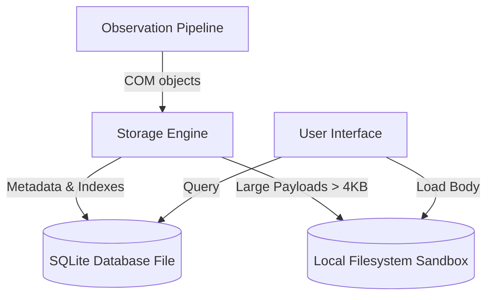
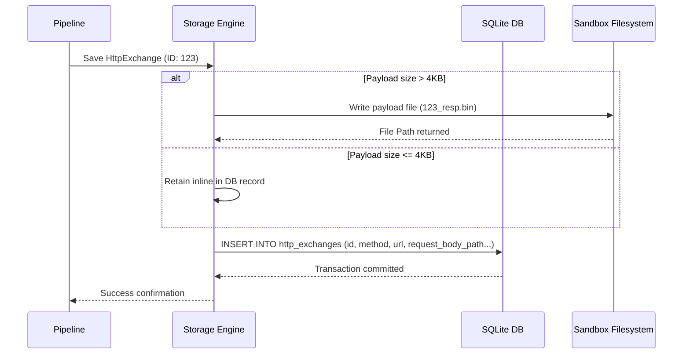
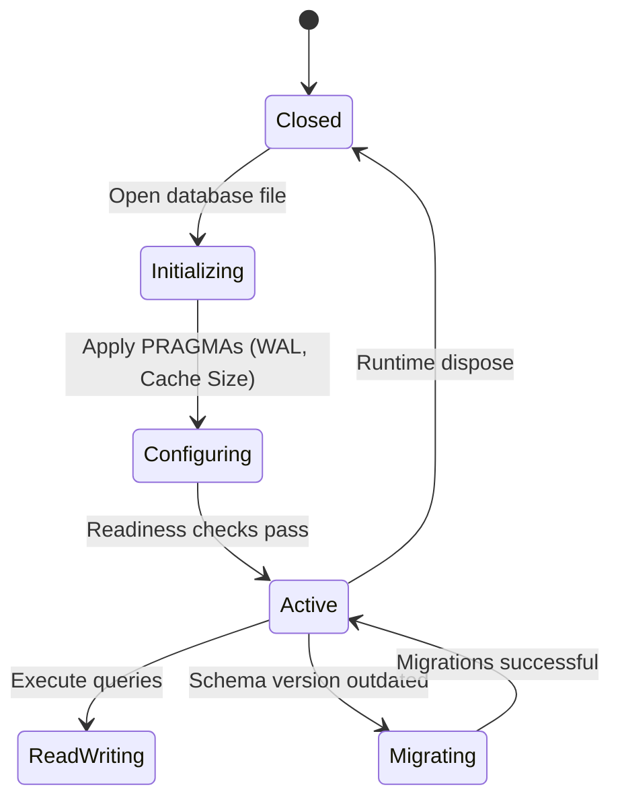

# 17_STORAGE_ENGINE.md

> Project: Kizuna Network Inspector
>
> Parent:
> [00_MASTER_SPEC.md](file:///Users/andri/Documents/development.nosync/kizuna-network-inspector/docs/00_MASTER_SPEC.md)
>
> Version: 1.0.1
>
> Status: Draft
>
> Document Type:
> Storage Engine Specification

---

## 1. Document Metadata

| Field | Value |
|---|---|
| Document | [17_STORAGE_ENGINE.md](file:///Users/andri/Documents/development.nosync/kizuna-network-inspector/docs/17_STORAGE_ENGINE.md) |
| Author | Kizuna Network Inspector Core Team |
| Version | 1.0.1-draft |
| Status | Draft |
| Target Platform | Rust Core (SQLite) / Platform Room / Core Data |
| Last Updated | 2026-06-27 |

---

## 2. Purpose

The Storage Engine provides high-performance local persistence for captured network traffic, session metadata, configurations, and indexes. It supports concurrent writes from the capture pipeline and responsive read queries from the user interface.

---

## 3. Scope

### In-Scope
- SQLite schema configuration optimized for rapid insertion of network transactions.
- Offloading large binary payloads (e.g., request/response bodies) to structured flat files instead of bloating the DB.
- Indexes for common search criteria (timestamps, hosts, status codes, methods).
- Session lifecycle policies (retention limits, deletion of old sessions, storage usage capping).
- Schema migrations.

### Out-of-Scope
- Full-text search matching (delegated to [18_SEARCH_ENGINE.md](file:///Users/andri/Documents/development.nosync/kizuna-network-inspector/docs/18_SEARCH_ENGINE.md)).
- Network protocol parsing (delegated to [16_HTTP_ENGINE.md](file:///Users/andri/Documents/development.nosync/kizuna-network-inspector/docs/16_HTTP_ENGINE.md)).

---

## 4. Definitions

- **WAL (Write-Ahead Logging)**: An optimization mode in SQLite that allows concurrent reads while writing.
- **Session DB**: A database file containing the tables representing a single [CaptureSession](file:///Users/andri/Documents/development.nosync/kizuna-network-inspector/docs/07_UBIQUITOUS_LANGUAGE.md#capturesession).
- **External Payload Store**: A filesystem directory storing heavy payload bodies, matching DB indexes.

---

## 5. Requirements

### Functional Requirements

| ID | Title | Priority | Description | Acceptance Criteria |
|---|---|---|---|---|
| **ST-001** | Transaction Logging | Critical | Persist HTTP request/response exchanges immediately upon processing. | <ul><li>[ ] Insert times under 5ms</li><li>[ ] Recover database state after crash</li></ul> |
| **ST-002** | Payload Isolation | High | Write body data above 4KB to the local storage filesystem; save file paths in the DB. | <ul><li>[ ] Keeps database files compact</li><li>[ ] Fast blob read times</li></ul> |
| **ST-003** | Retention Policy | High | Delete oldest capture session data automatically when storage exceeds user configurations. | <ul><li>[ ] Configurable storage limit (e.g., 500MB)</li><li>[ ] Background pruning task</li></ul> |
| **ST-004** | Schema Migrations | High | Execute database upgrades safely without corrupting previous developer sessions. | <ul><li>[ ] Migration test script</li><li>[ ] Incremental schema versioning</li></ul> |

### Non-Functional Requirements

| ID | Category | Target Metric | Description |
|---|---|---|---|
| **NTR-001** | Capacity | `100,000` exchanges | Must handle large logs without query performance degradation. |
| **NTR-002** | Security | Local access only | DB permissions set strictly to the application sandbox. |

---

## 6. Architecture



---

## 7. Components

- **`DatabaseConnectionPool`**: Configures SQLite in WAL mode, managing read/write handle limits.
- **`SessionRepository`**: Exposes operations to store, fetch, and search [HttpExchange](file:///Users/andri/Documents/development.nosync/kizuna-network-inspector/docs/07_UBIQUITOUS_LANGUAGE.md#httpexchange) database models.
- **`BlobStore`**: Manages filesystem writes, reading, and checksum validation for raw response bodies.
- **`RetentionManager`**: Runs background tasks calculating disk footprints and executing cleanup operations.

---

## 8. Data Models

### Database Schema (SQLite ERD representation)

```sql
CREATE TABLE capture_sessions (
    id TEXT PRIMARY KEY,
    name TEXT NOT NULL,
    start_time INTEGER NOT NULL,
    end_time INTEGER
);

CREATE TABLE http_exchanges (
    id TEXT PRIMARY KEY,
    session_id TEXT NOT NULL,
    method TEXT NOT NULL,
    url TEXT NOT NULL,
    status_code INTEGER,
    timestamp INTEGER NOT NULL,
    duration INTEGER,
    request_headers TEXT,
    response_headers TEXT,
    request_body_path TEXT,
    response_body_path TEXT,
    FOREIGN KEY(session_id) REFERENCES capture_sessions(id) ON DELETE CASCADE
);

CREATE INDEX idx_exchanges_session_time ON http_exchanges(session_id, timestamp DESC);
CREATE INDEX idx_exchanges_url ON http_exchanges(url);
CREATE INDEX idx_exchanges_status ON http_exchanges(status_code);
```

---

## 9. Sequence Diagrams



---

## 10. State Diagrams

### Database Connection Management State



---

## 11. Implementation Notes

### JNI & FFI Native Interoperability Rules
To prevent memory leaks and crashes at the Kotlin-Rust boundary (per [00_ENGINEERING_RULES.md](file:///Users/andri/Documents/development.nosync/kizuna-network-inspector/docs/00_ENGINEERING_RULES.md) Section 7):

#### Rust Android JNI Entrypoints (NDK Binding)
```rust
use jni::JNIEnv;
use jni::objects::{JClass, JString};
use jni::sys::{jlong, jint, jbyteArray};

#[no_mangle]
pub unsafe extern "C" fn Java_com_kni_platform_storage_NativeStorageEngine_storage_1engine_1init(
    mut env: JNIEnv,
    _class: JClass,
    db_path: JString,
) -> jlong {
    let path_str: String = env.get_string(&db_path).unwrap().into();
    let engine = Box::into_raw(Box::new(StorageEngine::new(&path_str)));
    engine as jlong
}

#[no_mangle]
pub unsafe extern "C" fn Java_com_kni_platform_storage_NativeStorageEngine_storage_1engine_1free(
    _env: JNIEnv,
    _class: JClass,
    engine_ptr: jlong,
) {
    if engine_ptr != 0 {
        let _ = Box::from_raw(engine_ptr as *mut StorageEngine);
    }
}

#[no_mangle]
pub unsafe extern "C" fn Java_com_kni_platform_storage_NativeStorageEngine_storage_1engine_1write_1exchange(
    mut env: JNIEnv,
    _class: JClass,
    engine_ptr: jlong,
    exchange_cbor: jbyteArray,
) -> jint {
    let engine = &mut *(engine_ptr as *mut StorageEngine);
    let bytes = env.convert_byte_array(&exchange_cbor).unwrap();
    match engine.write_exchange(&bytes) {
        Ok(_) => 0,
        Err(_) => -1,
    }
}
```

#### Kotlin JNI Binding Interface
```kotlin
package com.kni.platform.storage

class NativeStorageEngine private constructor(private val nativePtr: Long) {
    companion object {
        init {
            System.loadLibrary("kni_rust_core")
        }
        fun create(dbPath: String): NativeStorageEngine = NativeStorageEngine(storage_engine_init(dbPath))
    }

    fun writeExchange(exchangeCbor: ByteArray): Int {
        return storage_engine_write_exchange(nativePtr, exchangeCbor)
    }

    fun destroy() {
        storage_engine_free(nativePtr)
    }

    private external fun storage_engine_init(dbPath: String): Long
    private external fun storage_engine_free(enginePtr: Long)
    private external fun storage_engine_write_exchange(enginePtr: Long, cbor: ByteArray): Int
}
```

1. **Unwind Safety**: Database connection opens and query transactions are executed within `catch_unwind` bounds in Rust code to avoid panicking through FFI boundaries.
2. **Explicit Connection Destructors**: SQLite connection pool pointers are disposed of via the native destructor function `storage_engine_free(pool_ptr)`.
3. **Data Passing**: Results sets are serialized as CBOR buffers for rapid transmission from Rust to Kotlin/Swift.

### PRAGMAs
- The storage engine runs using:
  - `PRAGMA journal_mode = WAL;` (Concurrency)
  - `PRAGMA synchronous = NORMAL;` (Faster writes, safe for app crashes)
  - `PRAGMA foreign_keys = ON;` (Referential integrity)
- **Encryption**: If SQLCipher is configured, database files are encrypted locally with a secure, hardware-bound key.

---

## 12. Acceptance Criteria

- [ ] Inserts and updates to the database complete without blocking the UI thread.
- [ ] Large request and response payloads are successfully written to sandbox files.
- [ ] Deleting a `capture_session` cascade-deletes all associated `http_exchanges` and disk blobs.
- [ ] Schema versioning works on database initialization, and upgrades migrations safely.
- [ ] Database handles sudden app terminations without corrupting the indices.

---

## 13. Future Improvements

- **Database Compression**: Background compression of database files during idle times.
- **SQLCipher Support**: Standard option for full-database encryption in security-focused builds.

---

## 14. References

- [00_MASTER_SPEC.md](file:///Users/andri/Documents/development.nosync/kizuna-network-inspector/docs/00_MASTER_SPEC.md)
- [00_ENGINEERING_RULES.md](file:///Users/andri/Documents/development.nosync/kizuna-network-inspector/docs/00_ENGINEERING_RULES.md)
- [16_HTTP_ENGINE.md](file:///Users/andri/Documents/development.nosync/kizuna-network-inspector/docs/16_HTTP_ENGINE.md)
