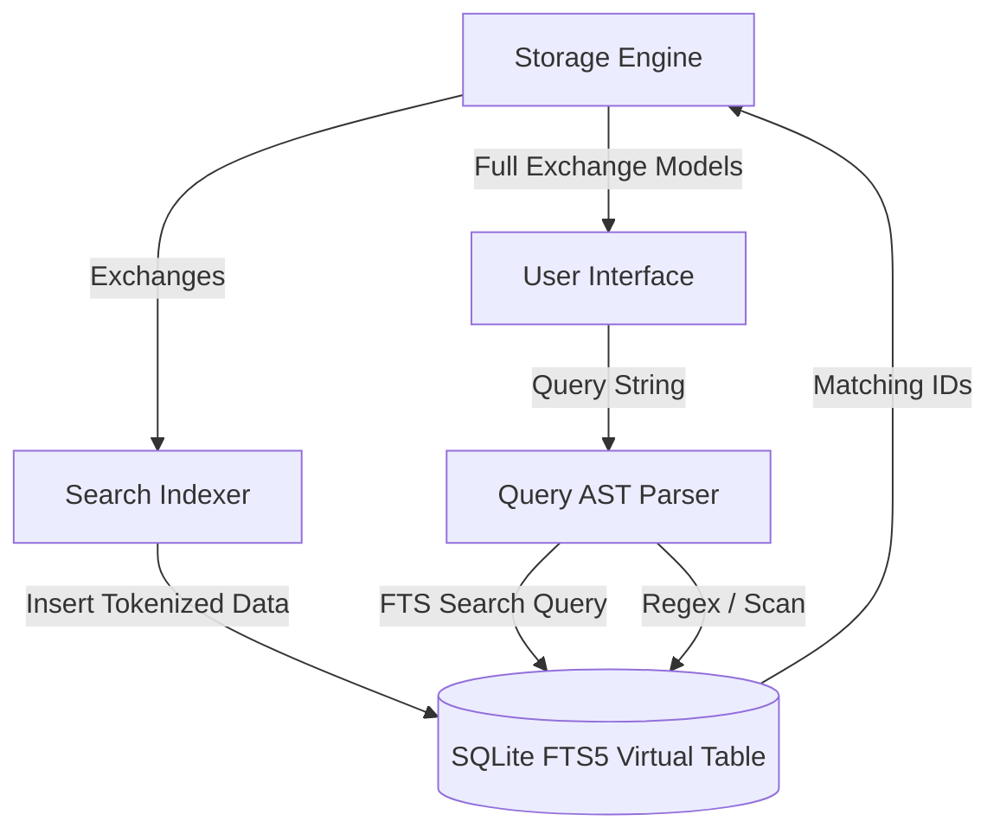
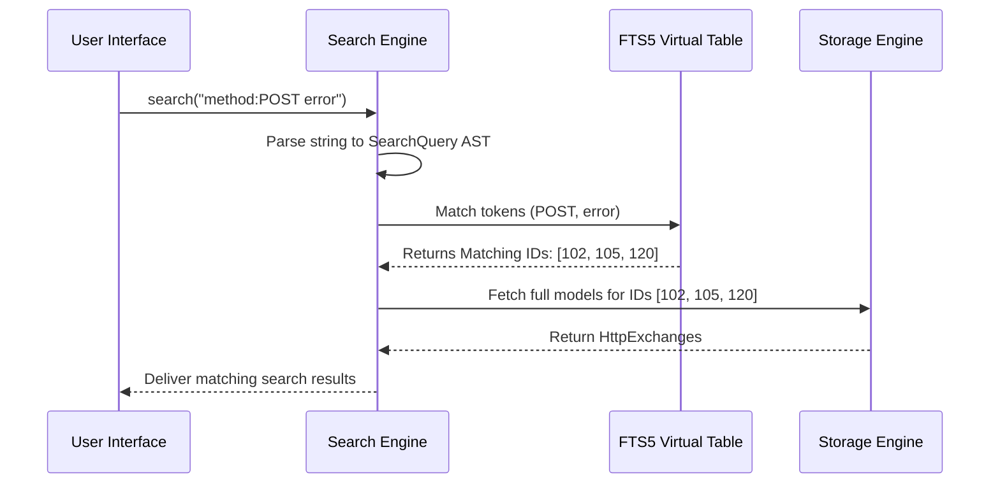
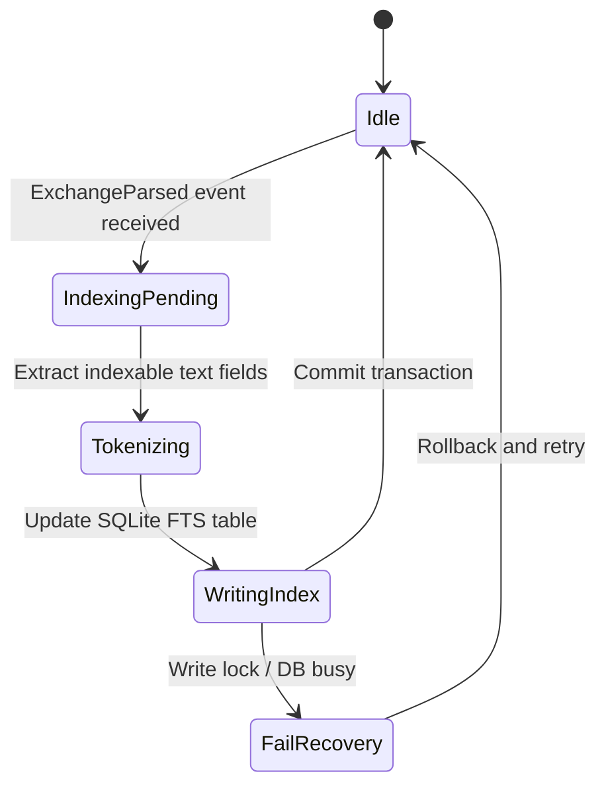

# 18_SEARCH_ENGINE.md

> Project: Kizuna Network Inspector
>
> Parent:
> [00_MASTER_SPEC.md](file:///Users/andri/Documents/development.nosync/kizuna-network-inspector/docs/00_MASTER_SPEC.md)
>
> Version: 1.0.1
>
> Status: Draft
>
> Document Type:
> Search Engine Specification

---

## 1. Document Metadata

| Field | Value |
|---|---|
| Document | [18_SEARCH_ENGINE.md](file:///Users/andri/Documents/development.nosync/kizuna-network-inspector/docs/18_SEARCH_ENGINE.md) |
| Author | Kizuna Network Inspector Core Team |
| Version | 1.0.1-draft |
| Status | Draft |
| Target Platform | Rust Shared Core (Cross-platform) |
| Last Updated | 2026-06-27 |

---

## 2. Purpose

The Search Engine provides fast full-text searching, filtering, and indexing across all captured network transactions. It indexes request/response text headers, URLs, query parameters, status codes, and body payloads to enable developers to locate specific failures instantly.

---

## 3. Scope

### In-Scope
- Full-text search (FTS) indexing of HTTP methods, URLs, headers, and request/response body payloads.
- Syntax-based queries (e.g., searching by specific keys: `status:500`, `method:POST`, `header:Authorization`).
- Regular expression (regex) search matching.
- Incremental indexing of new transactions during live captures.
- Paginated search result streaming.

### Out-of-Scope
- Persistent storage of transaction logs (delegated to [17_STORAGE_ENGINE.md](file:///Users/andri/Documents/development.nosync/kizuna-network-inspector/docs/17_STORAGE_ENGINE.md)).
- Complex protocol analysis (delegated to [16_HTTP_ENGINE.md](file:///Users/andri/Documents/development.nosync/kizuna-network-inspector/docs/16_HTTP_ENGINE.md)).

---

## 4. Definitions

- **FTS (Full-Text Search)**: A mechanism in databases to match words inside large text columns using specialized index tables (e.g., SQLite FTS5).
- **Tokenization**: The process of breaking down strings (like URLs or JSON bodies) into searchable words or tokens.
- **Search Query AST**: Abstract Syntax Tree parsed from user search input to isolate field-specific query keywords.

---

## 5. Requirements

### Functional Requirements

| ID | Title | Priority | Description | Acceptance Criteria |
|---|---|---|---|---|
| **SR-001** | Full-Text Indexing | Critical | Automatically index headers and bodies of completed exchanges. | <ul><li>[ ] Support SQLite FTS5 virtual tables</li><li>[ ] Index on transaction commit</li></ul> |
| **SR-002** | Field-Specific Filters | Critical | Support queries filtering by method, URL, status code, and header properties. | <ul><li>[ ] Match syntax: `method:POST`</li><li>[ ] Match syntax: `status:4xx`</li></ul> |
| **SR-003** | Regex Match Support | High | Allow users to supply standard regular expressions to query body payloads. | <ul><li>[ ] Support Rust `regex` crate evaluation</li><li>[ ] Safe timeout on complex regex operations</li></ul> |
| **SR-004** | Incremental Search | High | Deliver live matching results as new exchanges are captured. | <ul><li>[ ] UI notifications for matches</li></ul> |

### Non-Functional Requirements

| ID | Category | Target Metric | Description |
|---|---|---|---|
| **NTR-001** | Query Latency | `< 100ms` for 100,000 logs | Basic search queries must execute almost instantaneously. |
| **NTR-002** | Index Overhead | `< 25%` of raw text size | Index structures must remain compact so as not to exhaust mobile storage space. |

---

## 6. Architecture

The Search Engine layers directly on top of the Storage SQLite database using virtual tables.



---

## 7. Components

- **`QueryParser`**: Parses user-entered query strings (e.g., `status:500 api/v1`) into structured filter objects.
- **`FtsManager`**: Creates and maintains SQLite FTS5 virtual tables, handling database trigger operations.
- **`RegexScanner`**: Evaluates custom regular expressions against body payloads stored on disk.
- **`ResultStreamer`**: Collects matched identifiers, applies sorting parameters, and returns pages to the presentation layer.

---

## 8. Data Models

### Search Query Definition

```rust
struct SearchQuery {
    raw_query: String,
    methods: Vec<String>,
    status_codes: Vec<u16>,
    url_patterns: Vec<String>,
    headers: HashMap<String, String>,
    body_regex: Option<String>,
}
```

---

## 9. Sequence Diagrams



---

## 10. State Diagrams

### Indexing Lifecycle State



---

## 11. Implementation Notes

### JNI & FFI Native Interoperability Rules
To prevent memory leaks and crashes at the Kotlin-Rust boundary (per [00_ENGINEERING_RULES.md](file:///Users/andri/Documents/development.nosync/kizuna-network-inspector/docs/00_ENGINEERING_RULES.md) Section 7):

#### Rust Android JNI Entrypoints (NDK Binding)
```rust
use jni::JNIEnv;
use jni::objects::{JClass, JString};
use jni::sys::{jlong, jbyteArray};

#[no_mangle]
pub unsafe extern "C" fn Java_com_kni_platform_search_NativeSearchEngine_search_1engine_1new(
    mut env: JNIEnv,
    _class: JClass,
    db_path: JString,
) -> jlong {
    let path_str: String = env.get_string(&db_path).unwrap().into();
    let engine = Box::into_raw(Box::new(SearchEngine::new(&path_str)));
    engine as jlong
}

#[no_mangle]
pub unsafe extern "C" fn Java_com_kni_platform_search_NativeSearchEngine_search_1engine_1free(
    _env: JNIEnv,
    _class: JClass,
    engine_ptr: jlong,
) {
    if engine_ptr != 0 {
        let _ = Box::from_raw(engine_ptr as *mut SearchEngine);
    }
}

#[no_mangle]
pub unsafe extern "C" fn Java_com_kni_platform_search_NativeSearchEngine_search_1engine_1query(
    mut env: JNIEnv,
    _class: JClass,
    engine_ptr: jlong,
    query_str: JString,
) -> jbyteArray {
    let engine = &mut *(engine_ptr as *mut SearchEngine);
    let query: String = env.get_string(&query_str).unwrap().into();
    let results = engine.query(&query);
    env.byte_array_from_slice(&results).unwrap()
}
```

#### Kotlin JNI Binding Interface
```kotlin
package com.kni.platform.search

class NativeSearchEngine private constructor(private val nativePtr: Long) {
    companion object {
        init {
            System.loadLibrary("kni_rust_core")
        }
        fun create(dbPath: String): NativeSearchEngine = NativeSearchEngine(search_engine_new(dbPath))
    }

    fun query(searchQuery: String): ByteArray {
        return search_engine_query(nativePtr, searchQuery)
    }

    fun destroy() {
        search_engine_free(nativePtr)
    }

    private external fun search_engine_new(dbPath: String): Long
    private external fun search_engine_free(enginePtr: Long)
    private external fun search_engine_query(enginePtr: Long, queryStr: String): ByteArray
}
```

1. **Unwind Safety**: Free-text search matching and AST compilation are executed within `catch_unwind` bounds, returning error codes in case of invalid query configurations.
2. **Explicit Memory Deallocator**: Custom regex compilers and query state models must be explicitly freed using `search_engine_free(ptr)`.
3. **Data Passing**: Query matching result arrays are converted to CBOR buffers before FFI dispatch.

### SQLite FTS5
- Uses SQLite FTS5 extension with the `unicode61` tokenizer, configured to handle separators like `/`, `?`, `=`, and `&` to make URLs searchable by sub-tokens.
- **Payload Indexing Limit**: In order to prevent excessive index size, response bodies exceeding 100KB are not indexed for full-text search, but remains eligible for line-by-line regex scanning.

---

## 12. Acceptance Criteria

- [ ] Typing a simple keyword matches URL, header keys/values, and body contents.
- [ ] Field-specific search commands (`status:`, `method:`) successfully filter out mismatched results.
- [ ] Regular expression search executes correctly on response bodies.
- [ ] The search subsystem performs paginated fetches, yielding smooth UI lists.
- [ ] High-volume database writes do not block or crash search queries.

---

## 13. Future Improvements

- **Semantic Search**: Basic client-side NLP token matching.
- **Predefined Search Filters**: Saved searches for standard errors, redirects, or heavy media assets.

---

## 14. References

- [00_MASTER_SPEC.md](file:///Users/andri/Documents/development.nosync/kizuna-network-inspector/docs/00_MASTER_SPEC.md)
- [00_ENGINEERING_RULES.md](file:///Users/andri/Documents/development.nosync/kizuna-network-inspector/docs/00_ENGINEERING_RULES.md)
- [17_STORAGE_ENGINE.md](file:///Users/andri/Documents/development.nosync/kizuna-network-inspector/docs/17_STORAGE_ENGINE.md)
