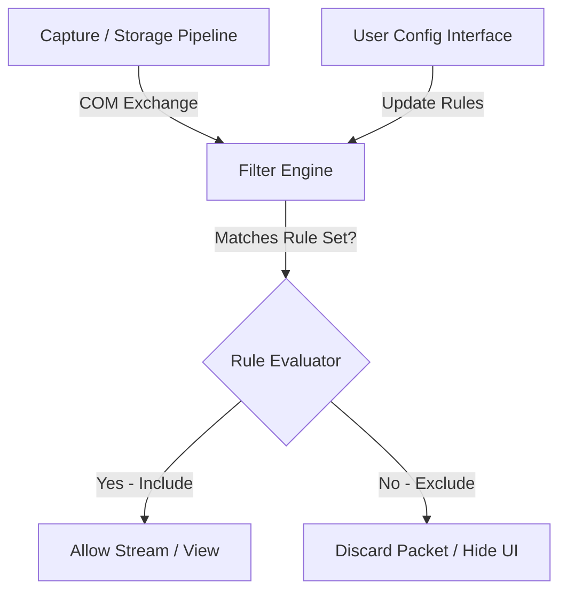
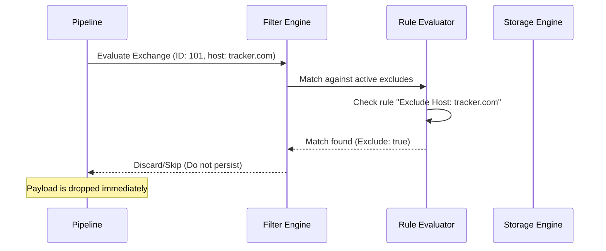
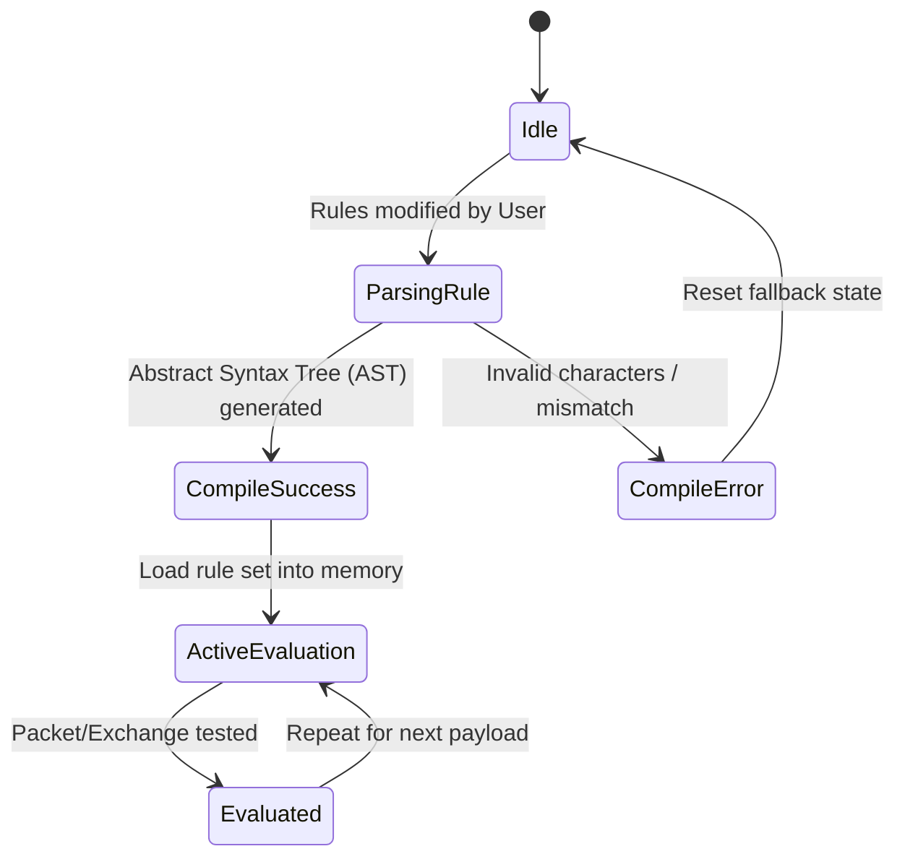

# 19_FILTER_ENGINE.md

> Project: Kizuna Network Inspector
>
> Parent:
> [00_MASTER_SPEC.md](file:///Users/andri/Documents/development.nosync/kizuna-network-inspector/docs/00_MASTER_SPEC.md)
>
> Version: 1.0
>
> Status: Draft
>
> Document Type:
> Filter Engine Specification

---

## 1. Document Metadata

| Field | Value |
|---|---|
| Document | [19_FILTER_ENGINE.md](file:///Users/andri/Documents/development.nosync/kizuna-network-inspector/docs/19_FILTER_ENGINE.md) |
| Author | Kizuna Network Inspector Core Team |
| Version | 1.0.0-draft |
| Status | Draft |
| Target Platform | Rust Shared Core (Cross-platform) |
| Last Updated | 2026-06-27 |

---

## 2. Purpose

The Filter Engine is a logical subsystem that evaluates complex conditional expressions against incoming or stored [HttpExchange](file:///Users/andri/Documents/development.nosync/kizuna-network-inspector/docs/07_UBIQUITOUS_LANGUAGE.md#httpexchange) structures. It supports exclude rules (e.g., hiding analytic logs) and inclusion rules (e.g., highlighting billing api endpoints) to help developers clean up noisy capture feeds.

---

## 3. Scope

### In-Scope
- Parsing logic for filter expressions (Boolean operators: `AND`, `OR`, `NOT`).
- Live filtering of streaming captures (deciding whether to ignore or capture specific traffic paths).
- Standard filter categories: Hostname, Port, HTTP Method, Content-Type, Status Code, Latency, Protocol.
- Configuration models for persistent filter lists.

### Out-of-Scope
- Database querying optimizations (delegated to [17_STORAGE_ENGINE.md](file:///Users/andri/Documents/development.nosync/kizuna-network-inspector/docs/17_STORAGE_ENGINE.md)).
- Free-text indexing (delegated to [18_SEARCH_ENGINE.md](file:///Users/andri/Documents/development.nosync/kizuna-network-inspector/docs/18_SEARCH_ENGINE.md)).

---

## 4. Definitions

- **Capture Filter**: Criteria applied at the capture boundary to discard packet streams entirely before parsing (saving memory/battery).
- **Display Filter**: Rules applied in-memory at the UI layer to temporarily show or hide captured logs.
- **Rule Set**: An ordered collection of inclusive/exclusive filter conditions.

---

## 5. Requirements

### Functional Requirements

| ID | Title | Priority | Description | Acceptance Criteria |
|---|---|---|---|---|
| **FE-001** | Capture Exclusions | Critical | Support discarding specific hostnames or endpoints from being parsed/stored. | <ul><li>[ ] Exclude tracking APIs</li><li>[ ] Apply rules at socket handshake</li></ul> |
| **FE-002** | Display Filters | Critical | Support filtering the UI transaction log without deleting underlying database records. | <ul><li>[ ] Filter by status, size, duration</li><li>[ ] Instantly update UI lists</li></ul> |
| **FE-003** | Custom Logical Syntax | High | Support logical rules using standard syntax (e.g. `method:GET AND (status:200 OR status:404)`). | <ul><li>[ ] Evaluate nested parenthetical groups</li><li>[ ] String match modifiers (contains, equals, regex)</li></ul> |
| **FE-004** | Target Content-Types | High | Filter by standard mime-types (JSON, XML, HTML, Images, Video, CSS). | <ul><li>[ ] Group sub-types dynamically</li></ul> |

### Non-Functional Requirements

| ID | Category | Target Metric | Description |
|---|---|---|---|
| **NTR-001** | Performance | Latency `< 0.1ms` per observation | Live stream filter checks must not slow down packet processing loops. |
| **NTR-002** | Consistency | Identical results | Filtering must behave deterministically across database and in-memory streams. |

---

## 6. Architecture



---

## 7. Components

- **`ExpressionParser`**: Generates logical executable rule trees from plain text filter configurations.
- **`RuleEvaluator`**: The logic processor that matches a [HttpExchange](file:///Users/andri/Documents/development.nosync/kizuna-network-inspector/docs/07_UBIQUITOUS_LANGUAGE.md#httpexchange) against the parsed rule tree.
- **`CaptureFilterManager`**: Handles kernel-level exclusions (e.g., skip decrypting specific domain matches).
- **`DisplayFilterManager`**: Feeds filter outputs directly to the UI rendering state.

---

## 8. Data Models

### Rule Specification

```rust
enum FilterCondition {
    Method(String),
    Host(String),
    Status(u16, u16), // Min, Max range
    ContentType(String),
    DurationMs(u64),  // Exceeds ms
}

struct FilterRule {
    id: String,
    name: String,
    is_inclusive: bool, // true = include, false = exclude
    is_enabled: bool,
    condition: FilterCondition,
}
```

---

## 9. Sequence Diagrams



---

## 10. State Diagrams

### Filter Rule Execution Lifecycle



---

## 11. Implementation Notes

- **Optimizations**: Compile matches using simple string starts-with / ends-with and fast numeric boundary comparisons rather than running regex engines unless explicitly requested.
- **Predefined Presets**: Includes standard configuration sets:
  - "Hide Static Assets": Excludes `.png`, `.jpg`, `.css`, `.js`.
  - "Errors Only": Includes only status codes `>= 400` or TCP resets.

---

## 12. Acceptance Criteria

- [ ] Displays only the matching items when display filters are applied.
- [ ] Capture filters block designated domains from registering in the database entirely.
- [ ] Nested Boolean filters (`AND`, `OR`, `NOT`) execute matching logic accurately.
- [ ] Disabling a filter immediately returns the capture feed to its normal state.
- [ ] Unit tests cover multiple combined rules and negative scenarios.

---

## 13. Future Improvements

- **Wildcard Hosts**: Support wildcards like `*.google.com` or `api.*.io` in rule matches.
- **Export Filter Profiles**: Export/import filter profiles to share configs within developer teams.
