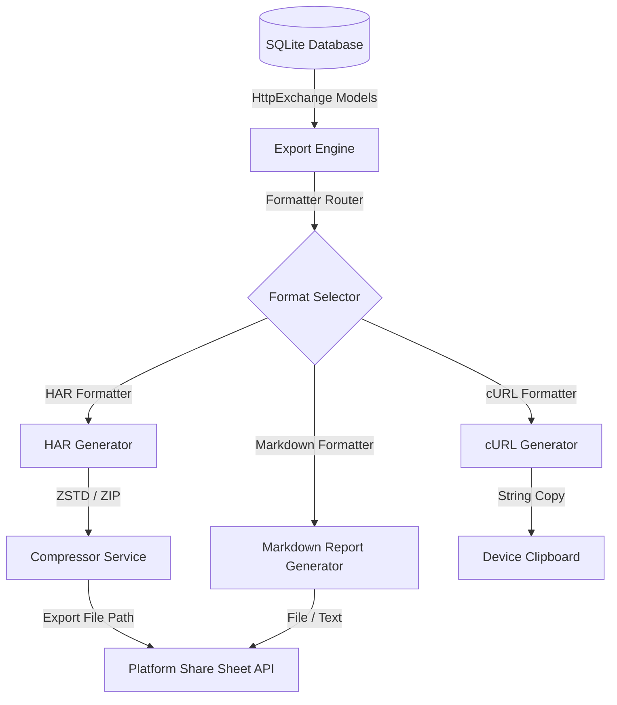
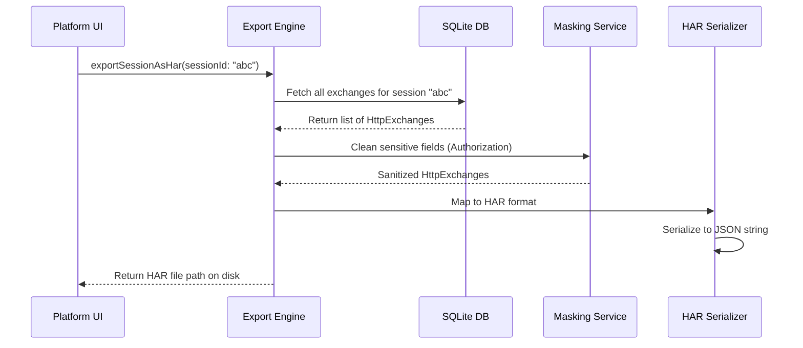
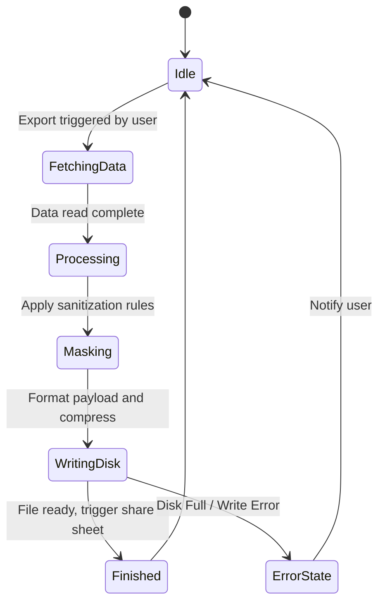

# 20_EXPORT_ENGINE.md

> Project: Kizuna Network Inspector
>
> Parent:
> [00_MASTER_SPEC.md](file:///Users/andri/Documents/development.nosync/kizuna-network-inspector/docs/00_MASTER_SPEC.md)
>
> Version: 1.0
>
> Status: Draft
>
> Document Type:
> Export Engine Specification

---

## 1. Document Metadata

| Field | Value |
|---|---|
| Document | [20_EXPORT_ENGINE.md](file:///Users/andri/Documents/development.nosync/kizuna-network-inspector/docs/20_EXPORT_ENGINE.md) |
| Author | Kizuna Network Inspector Core Team |
| Version | 1.0.0-draft |
| Status | Draft |
| Target Platform | Rust Shared Core (Cross-platform) |
| Last Updated | 2026-06-27 |

---

## 2. Purpose

The Export Engine converts captured [HttpExchange](file:///Users/andri/Documents/development.nosync/kizuna-network-inspector/docs/07_UBIQUITOUS_LANGUAGE.md#httpexchange) data models from the database into standardized transport formats—including HAR (HTTP Archive), formatted JSON, ready-to-run cURL commands, and Markdown summaries—enabling developers to share debug traces.

---

## 3. Scope

### In-Scope
- Generating HAR 1.2 files containing one or multiple HTTP transactions.
- Formatting individual HTTP requests into runnable cURL terminal commands.
- Bundling database session captures into compressed archive zip files for full diagnostic exports.
- Sanitizing sensitive values (e.g., token stripping, password masking) during the export process.

### Out-of-Scope
- UI sharing dialogues (delegated to native Android/iOS share sheets).
- Inbound HAR imports (delegated to future importer extensions).

---

## 4. Definitions

- **HAR (HTTP Archive)**: A JSON-formatted archive standard representing web browser and app network interactions.
- **cURL Command**: A shell command reproducing the exact headers, method, URL, and body payload of a network request.
- **Sanitization Rule**: Rules defining which headers or body parameters should be masked before leaving the device.

---

## 5. Requirements

### Functional Requirements

| ID | Title | Priority | Description | Acceptance Criteria |
|---|---|---|---|---|
| **EX-001** | cURL Export | Critical | Reconstruct a single request as an executable cURL command. | <ul><li>[ ] Properly escapes URLs and shells</li><li>[ ] Includes headers and body payloads</li></ul> |
| **EX-002** | HAR 1.2 Compliance | Critical | Generate files conforming to the HAR 1.2 specification. | <ul><li>[ ] Pass validation in standard HAR viewers</li><li>[ ] Accurate timings and status codes</li></ul> |
| **EX-003** | Sensitive Data Masking | High | Mask authentication headers (`Authorization`, `Cookie`) optionally before export. | <ul><li>[ ] Replace with `[MASKED]` string</li><li>[ ] Configurable exclusion lists</li></ul> |
| **EX-004** | Markdown Reporting | High | Generate human-readable Markdown summaries of connection errors. | <ul><li>[ ] Include system diagnostic context</li></ul> |

### Non-Functional Requirements

| ID | Category | Target Metric | Description |
|---|---|---|---|
| **NTR-001** | UI Responsiveness | Thread Isolation | Large session exports must compile in background tasks to prevent UI freezes. |
| **NTR-002** | Output Accuracy | Zero Data Loss | Exported payloads must retain exact binary formats, avoiding encoding conversions. |

---

## 6. Architecture



---

## 7. Components

- **`CurlFormatter`**: Translates request methods, headers, and body streams into command-line strings.
- **`HarSerializer`**: Maps COM models to the nested HAR JSON structure (log, creator, browser, pages, entries, request, response).
- **`MaskingService`**: Scrubs security credentials or credentials matched by rules.
- **`ArchivePacker`**: Bundles database SQLite segments and external body files into a single ZIP file.

---

## 8. Data Models

### HAR Log Entry Skeleton

```rust
struct HarEntry {
    started_date_time: String,
    time: f64,
    request: HarRequest,
    response: HarResponse,
    cache: HarCache,
    timings: HarTimings,
}
```

---

## 9. Sequence Diagrams



---

## 10. State Diagrams

### Export Job Lifecycle



---

## 11. Implementation Notes

- **cURL escaping**: Employs rigorous escaping for single quotes and binary data (e.g. using `curl --data-binary`) to make sure requests can be pasted directly into a Bash or Zsh terminal.
- **HPACK / Compression**: Decompresses headers and bodies prior to HAR mapping so they appear as readable text in standard tools like Charles Proxy or Proxyman.

---

## 12. Acceptance Criteria

- [ ] Exported HAR files open correctly in [HAR Analyzer](https://toolbox.googleapps.com/apps/har_analyzer/) and Charles.
- [ ] cURL outputs copy to clipboard and execute without shell parsing syntax errors.
- [ ] Export options allow selecting a single transaction or entire session.
- [ ] Sensitive headers (e.g., Bearer tokens) are successfully scrubbed when the masking setting is toggled on.
- [ ] Unit tests cover various content types (JSON, multi-part, binary).

---

## 13. Future Improvements

- **Postman Collection Export**: Support exporting captured sessions directly into a Postman Collection format.
- **Direct GitHub Gist Upload**: Share diagnostic summaries anonymously via private GitHub Gists or pastebins.
