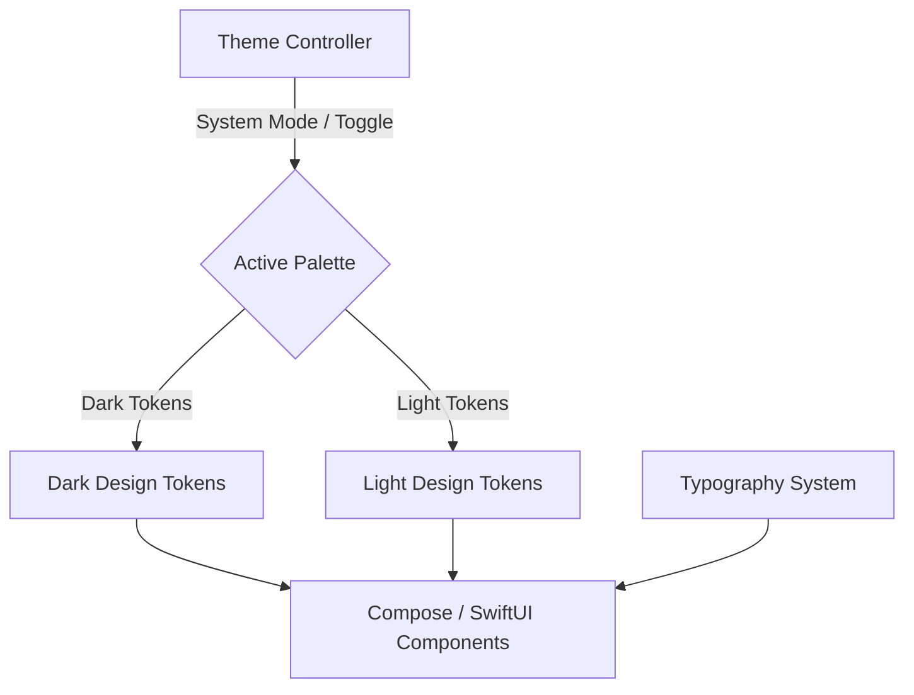
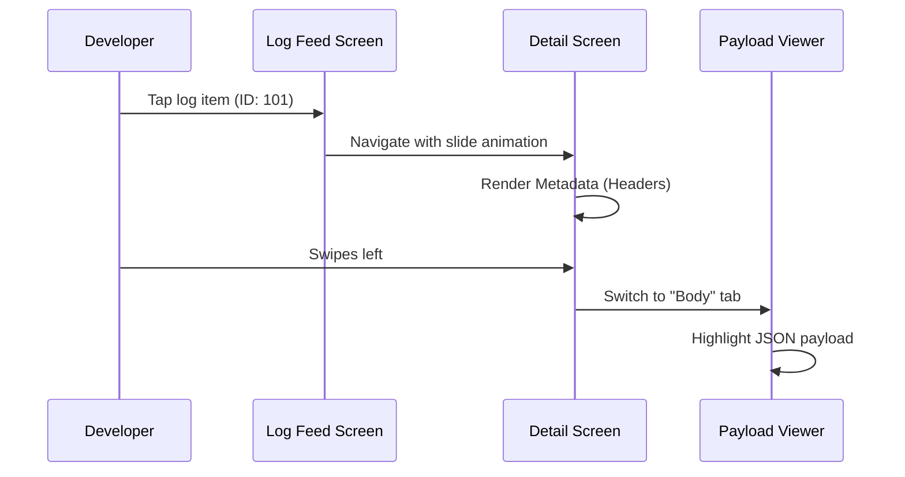
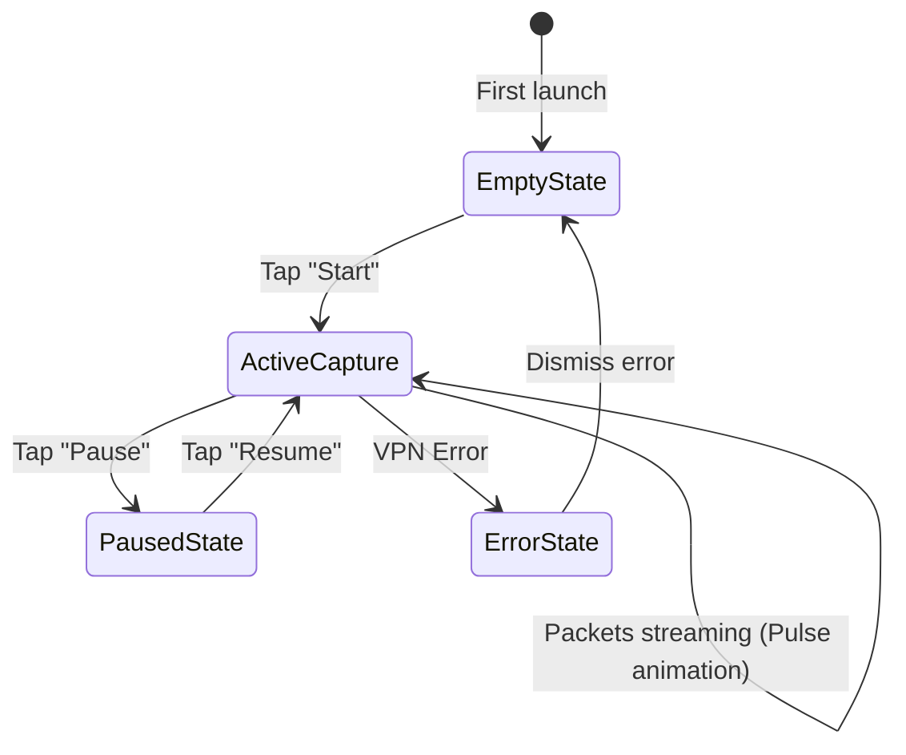

# 21_UI_UX.md

> Project: Kizuna Network Inspector
>
> Parent:
> [00_MASTER_SPEC.md](file:///Users/andri/Documents/development.nosync/kizuna-network-inspector/docs/00_MASTER_SPEC.md)
>
> Version: 1.0
>
> Status: Draft
>
> Document Type:
> UI/UX Design Specification

---

## 1. Document Metadata

| Field | Value |
|---|---|
| Document | [21_UI_UX.md](file:///Users/andri/Documents/development.nosync/kizuna-network-inspector/docs/21_UI_UX.md) |
| Author | Kizuna Network Inspector UX Team |
| Version | 1.0.0-draft |
| Status | Draft |
| Target Platforms | Android (Compose), iOS (SwiftUI) |
| Last Updated | 2026-06-27 |

---

## 2. Purpose

This document establishes the official design system, user experience flows, color token palettes, typography definitions, and component states for the Kizuna Network Inspector (KNI) mobile applications. It ensures a consistent, high-productivity developer experience across both platforms.

---

## 3. Scope

### In-Scope
- Color tokens, supporting Dark Mode by default.
- Typographic scale using developer-focused fonts (e.g. system monospaced fonts for headers/bodies).
- Navigation hierarchies and gesture controls.
- Component specifications (Log items, search bars, detail tabs).
- Interactive states (Active Capture, Paused, Empty, Error).

### Out-of-Scope
- Rust native desktop UI designs (handled under Tauri specs in the future).
- Mockups for custom themes beyond the default Dark/Light modes.

---

## 4. Definitions

- **Glassmorphism**: A UI design trend featuring semi-transparent backgrounds with blur effects, used to create a premium feel.
- **Log Feed**: The primary list containing scrollable HTTP transaction cards.
- **Developer-Focused UI**: Minimalist layouts optimized for information density rather than consumer marketing.

---

## 5. Requirements

### Functional Requirements

| ID | Title | Priority | Description | Acceptance Criteria |
|---|---|---|---|---|
| **UI-001** | Dark Mode First | Critical | The application must render in Dark Mode by default to match IDE color setups. | <ul><li>[ ] Contrast ratio >= 4.5:1</li><li>[ ] Support light mode toggle</li></ul> |
| **UI-002** | Transaction Color Coding | Critical | Status codes and HTTP methods must have distinct color-coded indicators. | <ul><li>[ ] Red for 5xx/4xx errors</li><li>[ ] Green for 2xx codes</li></ul> |
| **UI-003** | Collapsible Payloads | High | Body views (JSON, XML) must support code collapse/expand tree interactions. | <ul><li>[ ] Node toggles function instantly</li></ul> |
| **UI-004** | Density Settings | High | Support compact vs comfortable list layout densities. | <ul><li>[ ] Compact hides timing details</li></ul> |

---

## 6. Architecture (Design Tokens & Theme System)

---

## 7. Components

- **`LogFeedItem`**: High-density card displaying Method, URL, status badge, packet size, and duration.
- **`SearchBox`**: A sticky search header supporting autocomplete filters and validation.
- **`PayloadViewer`**: Code-highlighting viewer for payload analysis.
- **`StatusIndicator`**: A pulse animation showing capture activity (Active/Paused/Stopped).

---

## 8. Design Tokens (Data Models)

### Color Palette (Dark Mode Base)

| Token Name | Hex Code | Purpose |
|---|---|---|
| `--kni-bg-primary` | `#121214` | Main screen background |
| `--kni-bg-surface` | `#1E1E24` | Cards and list items |
| `--kni-accent` | `#6C5CE7` | Primary buttons and status indicators |
| `--kni-success` | `#00B894` | 2xx Status, Capturing state |
| `--kni-warning` | `#FDCB6E` | 3xx Status |
| `--kni-error` | `#D63031` | 4xx / 5xx Status, Network failure |
| `--kni-text-primary` | `#ECEFF1` | Header titles and status text |
| `--kni-text-secondary` | `#90A4AE` | Metadata and timestamps |

### Typography Scale

- **Header Large**: 22sp, Bold, Inter / System default
- **Header Medium**: 18sp, Semi-Bold, Inter
- **Body Text**: 14sp, Regular, Inter
- **Monospace Text**: 13sp, Regular, JetBrains Mono / SF Mono (Payloads, URLs)

---

## 9. Sequence Diagrams

### Interactive Detail Navigation

---

## 10. State Diagrams

### Live Capture Screen States

---

## 11. Implementation Notes

- **Font Interoperability**: On Android, bundles Google's `Inter` font family. On iOS, falls back to native `San Francisco` system font with mono styling where appropriate.
- **JSON rendering performance**: Rendering huge JSON blocks causes UI lag. KNI uses a custom virtual list tree parser so that only visible JSON nodes are rendered in memory.

---

## 12. Acceptance Criteria

- [ ] Theme toggling works instantly without requiring application restart.
- [ ] Tap targets for details and actions are at least `48dp` (Android) / `44pt` (iOS).
- [ ] Log feed handles rapid updates (100 packets/sec) without lagging the scroll frame.
- [ ] Color contrast meets WCAG AA standards.

---

## 13. Future Improvements

- **Custom Themes**: Support Dracula, Solarized, and Monokai color setups.
- **Export Mockups**: Built-in mock editor for editing response headers directly in the UI.
