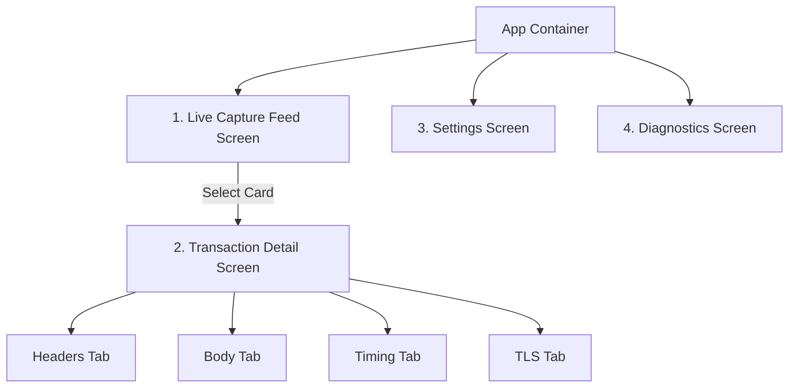
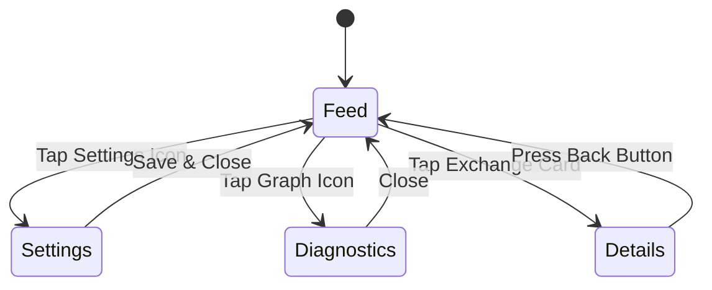

# 22_SCREEN_SPECIFICATION.md

> Project: Kizuna Network Inspector
>
> Parent:
> [00_MASTER_SPEC.md](file:///Users/andri/Documents/development.nosync/kizuna-network-inspector/docs/00_MASTER_SPEC.md)
>
> Version: 1.0
>
> Status: Draft
>
> Document Type:
> Screen-by-Screen Specification

---

## 1. Document Metadata

| Field | Value |
|---|---|
| Document | [22_SCREEN_SPECIFICATION.md](file:///Users/andri/Documents/development.nosync/kizuna-network-inspector/docs/22_SCREEN_SPECIFICATION.md) |
| Author | Kizuna Network Inspector Product Team |
| Version | 1.0.0-draft |
| Status | Draft |
| Target Platform | Mobile UI Client (Android & iOS) |
| Last Updated | 2026-06-27 |

---

## 2. Purpose

This document specifies the concrete layout structures, user controls, transition models, and interactive states for every screen in the Kizuna Network Inspector client applications.

---

## 3. Scope

### In-Scope
- Detailed specifications for the 4 core screens:
  1. **Live Capture Feed Screen**
  2. **Transaction Detail Screen** (Tabs: Headers, Body, Timing, TLS)
  3. **Settings Screen** (Root CA, storage cleanup, filters)
  4. **Diagnostics Screen** (CPU, Memory, Packet drop rate)
- Transition states: Empty, Loading, Active, Error.

### Out-of-Scope
- Platform-specific implementation languages (Compose vs SwiftUI details).
- Multi-window desktop layout specifications.

---

## 4. Definitions

- **Details Tab Bar**: The sub-navigation component inside the Transaction Detail Screen.
- **Diagnostics Dashboard**: Visual representation of the KNI runtime resource usage.

---

## 5. Requirements

### Functional Requirements

| ID | Title | Priority | Description | Acceptance Criteria |
|---|---|---|---|---|
| **SS-001** | Feed Controls | Critical | The Feed screen must expose clear Start/Pause floating actions. | <ul><li>[ ] Tapping starts/stops capture</li><li>[ ] Activity pulse matches state</li></ul> |
| **SS-002** | Deep-Link to Details | Critical | Selecting an exchange card must navigate to the detail view. | <ul><li>[ ] Zero latency transition</li></ul> |
| **SS-003** | Certificate Setup Wizard | High | Settings screen must link to a certificate trust helper dialog. | <ul><li>[ ] Step-by-step guidance</li><li>[ ] Verification button</li></ul> |
| **SS-004** | Live Graph Rendering | Medium | Diagnostics screen must render scrolling charts of packet memory. | <ul><li>[ ] Target 60 FPS redraws</li></ul> |

---

## 6. Architecture (Screen Hierarchy)



---

## 7. Screen Specifications

### 1. Live Capture Feed Screen
- **Purpose**: Real-time listing of captured network traffic.
- **Layout**:
  - *Top Header*: Search input field + filter tag toggles.
  - *Body*: Infinite scrollable list of HTTP transaction cards.
  - *Floating Control*: Large circular button to start/stop the capture engine.
- **States**:
  - `Empty`: Displays setup checklist when no packets are captured yet.
  - `Capturing`: Scroll list updates with a pulse effect in the header.
  - `Paused`: Control indicator switches to "Paused".

### 2. Transaction Detail Screen
- **Purpose**: Comprehensive inspection of a single HTTP request-response pair.
- **Layout**:
  - *Top Header*: Status code badge, method, and URL.
  - *Tabs*:
    - **Headers**: Collapsible request and response key-value headers.
    - **Body**: Text/JSON payload viewer with search-within-page capability.
    - **Timing**: Gantt-style progress bar charting connection overhead.
    - **TLS**: Cipher suite, protocol version, and server certificate details.

### 3. Settings Screen
- **Purpose**: System customization and Root CA installation.
- **Layout**:
  - *Certificate Block*: "Install Certificate" trigger with connection validator.
  - *Storage Options*: Sliding bar to adjust database limits (e.g. 100MB - 2GB).
  - *Filter Rules*: List of domain exclusion patterns with edit buttons.

### 4. Diagnostics Screen
- **Purpose**: System health metrics monitoring.
- **Layout**:
  - *System Cards*: Memory footprint, CPU utilization, DB write queues, and dropped packet count.

---

## 8. User Flow

```mermaid
sequenceDiagram
    participant Dev as Developer
    participant Feed as Capture Feed
    participant Details as Details View
    participant Settings as Settings Screen

    Dev->>Feed: Launches app
    Note over Feed: Displays "No Captured Traffic"
    Dev->>Settings: Tap Gear Icon
    Settings->>Settings: Install & Trust Certificate
    Dev->>Feed: Tap Floating Start Button
    Dev->>Feed: Reproduces bug in target app
    Feed->>Feed: Populates log list (live stream)
    Dev->>Feed: Taps POST request card
    Feed->>Details: Push Slide Transition
    Dev->>Details: Read payload error
```

---

## 9. State Diagrams

### Navigation & Lifecycle Transition



---

## 10. Implementation Notes

- **Scroll Performance**: Ensure Compose `LazyColumn` or SwiftUI `List` reuse elements cleanly without triggering garbage collection overhead.
- **Interactive Graphs**: The diagnostics graph uses canvas-based path rendering instead of third-party heavy charting libraries.

---

## 11. Acceptance Criteria

- [ ] Transition between tabs on the details screen operates instantly.
- [ ] Large request headers do not clip or break screen layout.
- [ ] User can copy URL, headers, and body elements individually to the clipboard.
- [ ] System back action consistently pops to the previous UI screen.

---

## 12. Future Improvements

- **Mock Editor View**: Add a new screen to configure interceptor mocks directly in the UI.
- **Dual-Pane Layout**: Side-by-side tablet layout for large screens.
