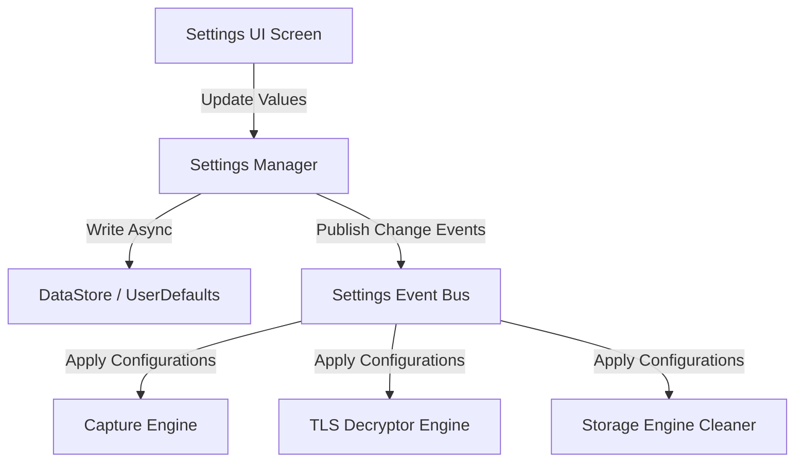
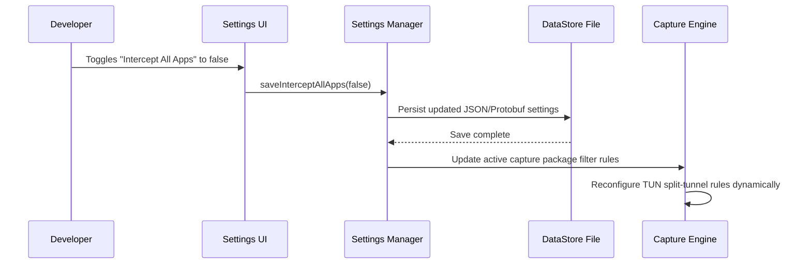
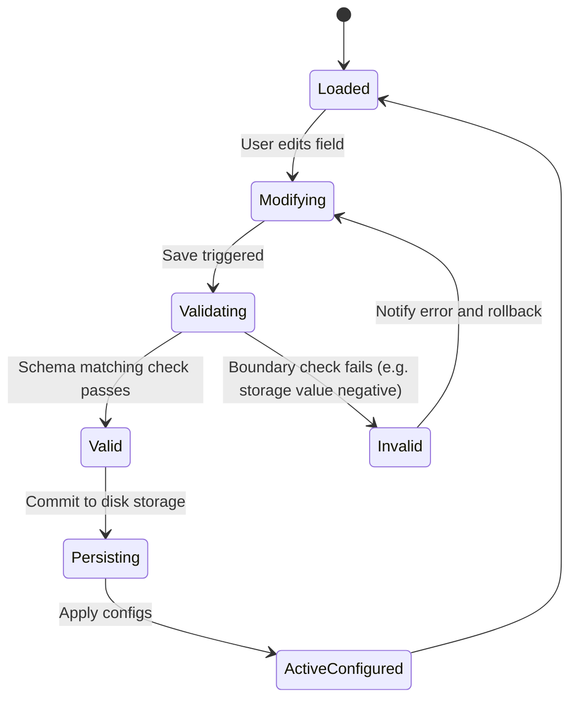

# 23_SETTINGS.md

> Project: Kizuna Network Inspector
>
> Parent:
> [00_MASTER_SPEC.md](file:///Users/andri/Documents/development.nosync/kizuna-network-inspector/docs/00_MASTER_SPEC.md)
>
> Version: 1.0
>
> Status: Draft
>
> Document Type:
> Configuration & Settings Specification

---

## 1. Document Metadata

| Field | Value |
|---|---|
| Document | [23_SETTINGS.md](file:///Users/andri/Documents/development.nosync/kizuna-network-inspector/docs/23_SETTINGS.md) |
| Author | Kizuna Network Inspector Core Team |
| Version | 1.0.0-draft |
| Status | Draft |
| Target Platform | Runtime Configuration Subsystem |
| Last Updated | 2026-06-27 |

---

## 2. Purpose

This document defines the configuration schemas, persistent storage strategies, properties, validation rules, and synchronization mechanisms for KNI runtime settings and user preferences.

---

## 3. Scope

### In-Scope
- Configuration keys for:
  - Capture Engine options (ports, IP rules, split-tunneling apps).
  - Security options (Root CA generation, certificate duration).
  - Storage retention rules (disk thresholds, auto-pruning).
  - Formatting and display options (theme, layout density).
- Platform-safe settings storage mechanisms (Jetpack DataStore on Android, UserDefaults on iOS).

### Out-of-Scope
- User credentials or external cloud sync credentials (not planned for KNI core).

---

## 4. Definitions

- **DataStore**: Modern type-safe persistent storage library for Kotlin applications.
- **Preference Versioning**: Upgrading older setting layouts to modern settings structures without wiping configuration choices.

---

## 5. Requirements

### Functional Requirements

| ID | Title | Priority | Description | Acceptance Criteria |
|---|---|---|---|---|
| **SE-001** | Persistent Settings | Critical | Settings must persist across application restarts. | <ul><li>[ ] Read/write on startup</li><li>[ ] Recover defaults if file corrupts</li></ul> |
| **SE-002** | Live Config Re-load | Critical | Modify capture rules (e.g. host bypass) and apply changes instantly without full engine restarts. | <ul><li>[ ] No packet capture loss</li><li>[ ] Triggers system reconfiguration</li></ul> |
| **SE-003** | Reset to Defaults | High | Provide a clear action to restore factory defaults. | <ul><li>[ ] Resets storage and filters</li></ul> |

---

## 6. Architecture (Configuration Flow)



---

## 7. Data Models

### Settings Configuration Object

```rust
struct RuntimeSettings {
    // Capture Engine settings
    capture_all_traffic: bool,
    intercepted_apps: Vec<String>, // Package IDs
    bypass_domains: Vec<String>,
    
    // Decryption settings
    enable_mitm_decryption: bool,
    trusted_ca_installed: bool,
    
    // Retention settings
    max_storage_mb: u32,
    auto_delete_on_exit: bool,
    
    // Appearance settings
    dark_mode_enabled: bool,
    compact_list_density: bool,
}
```

---

## 8. Sequence Diagrams

### Reconfiguring Capture Limits



---

## 9. State Diagrams

### Config Validation Lifecycle



---

## 10. Implementation Notes

- **Platform Wrappers**:
  - **Android**: Implemented using `androidx.datastore.core` using Kotlin serialization.
  - **iOS**: Implemented via `NSUserDefaults` or property-list files in the sandbox directory.
  - **Rust Shared Core**: Reads configuration structs serialized/deserialized via `serde_json`.

---

## 11. Acceptance Criteria

- [ ] Modifying storage limits immediately evaluates background storage cleanup if current footprint exceeds bounds.
- [ ] User preferences survive force-quitting the app.
- [ ] Passing invalid inputs (e.g. malformed hostname regex) fails validation gracefully.
- [ ] Settings configuration is readable on startup within `< 50ms`.

---

## 12. Future Improvements

- **Configuration Profiles**: Save settings configurations as files to export and share with other team developers.
- **Global Policy Enforcement**: Read custom developer configurations from project files in the repository.
