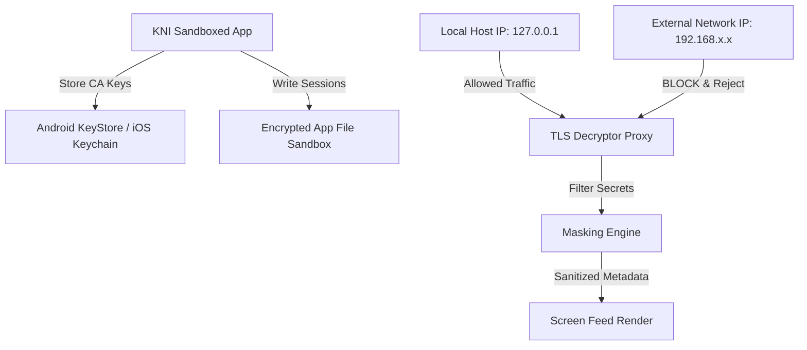
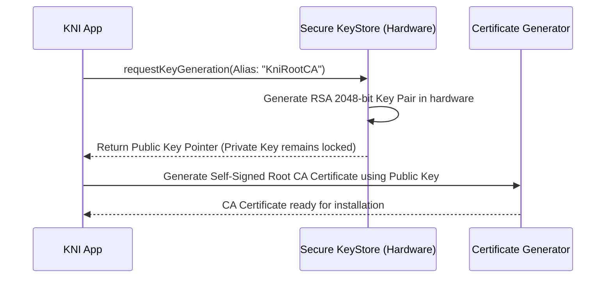
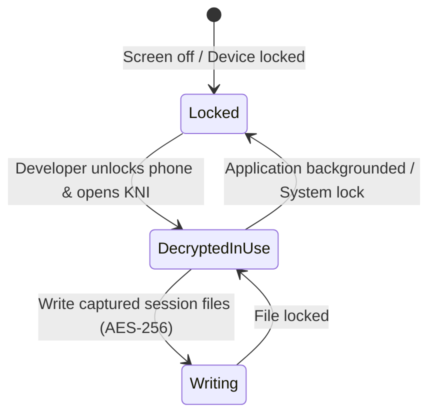

# 24_SECURITY.md

> Project: Kizuna Network Inspector
>
> Parent:
> [00_MASTER_SPEC.md](file:///Users/andri/Documents/development.nosync/kizuna-network-inspector/docs/00_MASTER_SPEC.md)
>
> Version: 1.0
>
> Status: Draft
>
> Document Type:
> Security Architecture Specification

---

## 1. Document Metadata

| Field | Value |
|---|---|
| Document | [24_SECURITY.md](file:///Users/andri/Documents/development.nosync/kizuna-network-inspector/docs/24_SECURITY.md) |
| Author | Kizuna Network Inspector Security Team |
| Version | 1.0.0-draft |
| Status | Draft |
| Target Platform | Global Platform Architecture |
| Last Updated | 2026-06-27 |

---

## 2. Purpose

This document outlines the security architecture, data isolation guidelines, certificate protection protocols, and privacy features of the Kizuna Network Inspector platform. KNI intercepts sensitive data; therefore, its internal operation must be secure to prevent local device vulnerabilities.

---

## 3. Scope

### In-Scope
- Certificate material lifecycle (Root CA private/public keys, ephemeral leaf keys).
- Secure storage options for database entries and body payloads.
- Interception boundary safeguards (preventing external devices from abusing the local MITM proxy).
- Privacy logs and automatic token masking standards.

### Out-of-Scope
- General operating system hardening or root exploit prevention mechanisms.

---

## 4. Definitions

- **KeyStore / Keychain**: Hardware-backed cryptographic key storage systems on Android and iOS devices.
- **Credential Masking**: Automated replacement of known secret fields (passwords, JWTs, Authorization headers) with secure masks before displaying/exporting logs.

---

## 5. Requirements

### Functional Requirements

| ID | Title | Priority | Description | Acceptance Criteria |
|---|---|---|---|---|
| **SEC-001** | Hardware-Backed CA | Critical | The local Root CA private key must reside inside the Android KeyStore / iOS Keychain. | <ul><li>[ ] Never exportable in plaintext</li><li>[ ] Cryptographic operations occur inside secure hardware</li></ul> |
| **SEC-002** | Local Sandbox Isolation | Critical | Captured databases and transaction files must be saved strictly inside the application sandbox. | <ul><li>[ ] Permissions locked to KNI app ID</li><li>[ ] No world-readable folders</li></ul> |
| **SEC-003** | Interface Binding | High | The capture proxy and runtime sockets must bind only to localhost (`127.0.0.1`). | <ul><li>[ ] Reject connections from external IPs</li><li>[ ] Prevent external port scanning</li></ul> |
| **SEC-004** | Log Masking | High | Detect and redact authorization fields in debug outputs automatically. | <ul><li>[ ] Scrub Bearer, Basic, and Cookie parameters</li></ul> |

---

## 6. Architecture (Security Boundaries)



---

## 7. Components

- **`HardwareKeyProvider`**: Generates and manages the Root CA RSA/ECC keys in the device's secure enclave.
- **`AccessControlManager`**: Configures loopback interface binds to ensure no external entities tap the decryption loops.
- **`CredentialRedactor`**: Scans payload models for common JSON security nodes (e.g. `password`, `access_token`, `client_secret`) and replaces them with a redacted string.

---

## 8. Data Models

### Masking Configuration Rules

```rust
struct MaskingRule {
    target_header: String,
    json_path: String, // e.g. "$.credentials.password"
    replacement_mask: String, // Default: "[REDACTED]"
    enabled: bool,
}
```

---

## 9. Sequence Diagrams

### Generating and Securing Root CA Keys



---

## 10. State Diagrams

### Local Storage Security State



---

## 11. Implementation Notes

- **Android Implementation**: Private key material is generated using `KeyGenParameterSpec` with `PURPOSE_SIGN` inside `AndroidKeyStore`. Ephemeral leaf certs are signed by calling `Signature` objects referencing this secure hardware key, ensuring the private key never enters KNI app memory.
- **SSL Pinning**: Clearly document that apps using SSL Pinning will not show decrypted traffic unless modified by tools like Frida, LSPosed, or custom network security configurations in Android development builds.

---

## 12. Acceptance Criteria

- [ ] Private keys are generated inside secure enclaves and cannot be extracted as raw bytes.
- [ ] Binding socket interfaces fails to accept external incoming packets from secondary devices.
- [ ] Turning on database encryption results in cipher text readable only by the validated KNI client instance.
- [ ] Port scanners show no open ports exposed by KNI to external WiFi/cellular interfaces.

---

## 13. Future Improvements

- **Biometric Lock**: Require face/fingerprint authentication before exposing captured network logs.
- **Self-Destruct Timers**: Automatically wipe session databases if the app remains unused for more than a configured duration.
