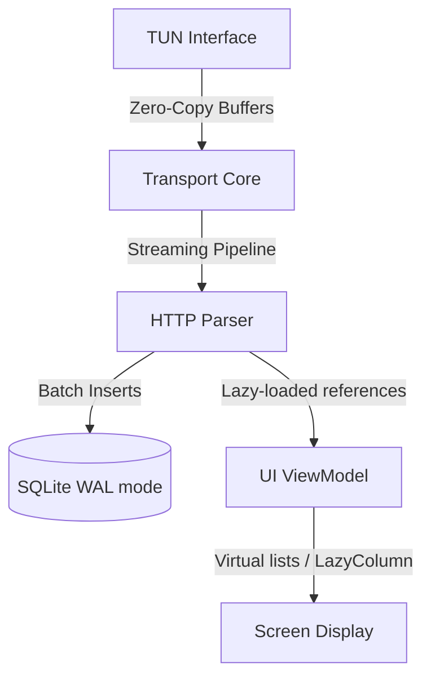
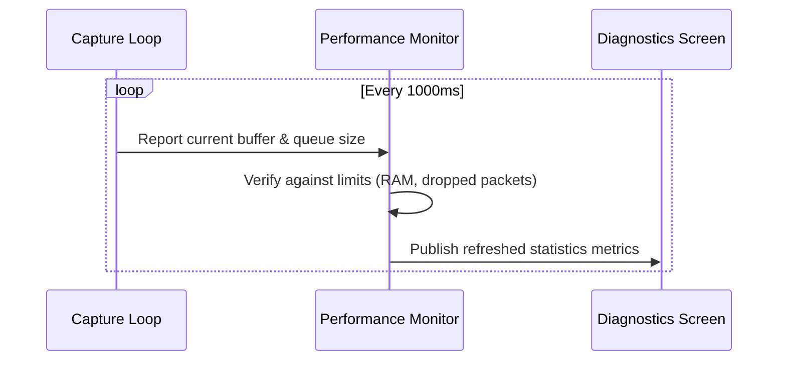
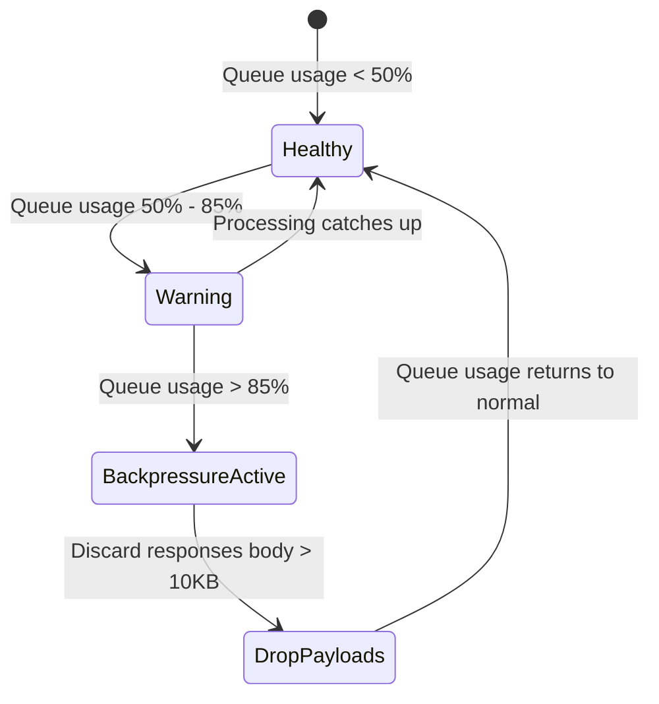

# 25_PERFORMANCE.md

> Project: Kizuna Network Inspector
>
> Parent:
> [00_MASTER_SPEC.md](file:///Users/andri/Documents/development.nosync/kizuna-network-inspector/docs/00_MASTER_SPEC.md)
>
> Version: 1.0
>
> Status: Draft
>
> Document Type:
> Performance Specification

---

## 1. Document Metadata

| Field | Value |
|---|---|
| Document | [25_PERFORMANCE.md](file:///Users/andri/Documents/development.nosync/kizuna-network-inspector/docs/25_PERFORMANCE.md) |
| Author | Kizuna Network Inspector Performance Team |
| Version | 1.0.0-draft |
| Status | Draft |
| Target Platform | System Performance Benchmarks |
| Last Updated | 2026-06-27 |

---

## 2. Purpose

This document defines the official performance budgets, latency limits, memory limits, and testing benchmarks for the Kizuna Network Inspector platform. KNI runs alongside target development apps; therefore, it must use minimal resources to avoid affecting client execution performance.

---

## 3. Scope

### In-Scope
- Memory footprint limits (heap, file handles, native allocations).
- Latency budgets for packet parsing, TCP reconstruction, and decryption.
- UI frame rate benchmarks (scrolling feeds, graph renders).
- Battery utilization guidelines.

### Out-of-Scope
- Benchmark rules for desktop companion applications.

---

## 4. Definitions

- **Frame Dropping (Jank)**: UI frames taking longer than `16.6ms` (at 60Hz) or `8.3ms` (at 120Hz) to render, causing visual stutter.
- **LeakCanary**: A memory leak detection library for Android applications.

---

## 5. Requirements

### Performance Budgets

| ID | Metric | Target | Rationale |
|---|---|---|---|
| **PERF-001** | Core Parser Overhead | `< 1ms` latency per packet | Ensure packet decoding does not slow down actual web requests. |
| **PERF-002** | Baseline RAM Usage | `< 150MB` | Keeps the background service from getting killed by OS memory managers. |
| **PERF-003** | Max DB Write Queue | `< 50ms` commit time | Fast database pipeline insertion. |
| **PERF-004** | Feed Render Speed | `60 - 120 FPS` stable | Stutter-free scrolling on modern mobile screens. |

---

## 6. Architecture (Performance Optimization Layers)

---

## 7. Key Optimization Strategies

### 1. Zero-Copy Packet Parsing
The Rust shared core operates on borrowed buffers (`&[u8]`) where possible, avoiding copy allocations during the initial packet read cycle.

### 2. Batch Persistence
SQLite database writes do not execute on individual packets. Transactions are buffered and committed in batches (every 500ms or 100 transactions) to minimize disk writes.

### 3. Virtualized UI Viewports
Only visible card items are parsed, formatted, and rendered in the UI viewports, ensuring memory usage stays flat even with 10,000+ logs.

---

## 8. Performance Monitoring Plan

---

## 9. State Diagrams

### Connection Backpressure Strategy

---

## 10. Implementation Notes

- **Android Profiling**: Continuous verification using Android Studio Profiler, focusing on CPU overhead, memory allocations, and database handles.
- **Rust Profiling**: Benchmarked using `Criterion` to verify performance variations across releases.

---

## 11. Acceptance Criteria

- [ ] Core execution pipeline adds no more than `2ms` of round-trip network latency to captured apps.
- [ ] Scrolling remains smooth (above 60fps) while capturing traffic under sustained 10Mbps load.
- [ ] Memory utilization stays within limits during 24-hour soak tests.
- [ ] No memory leaks reported by LeakCanary or Xcode Instruments.

---

## 12. Future Improvements

- **SIMD Optimizations**: Utilize Single Instruction Multiple Data vector instructions for header decodes.
- **Custom Heap Allocators**: Integrate allocators (like `jemalloc` or custom arena allocators) inside the Rust core to optimize memory usage.
