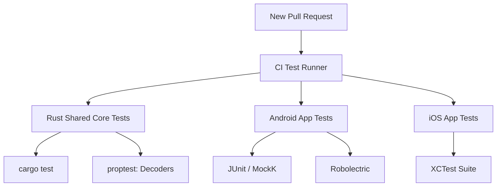
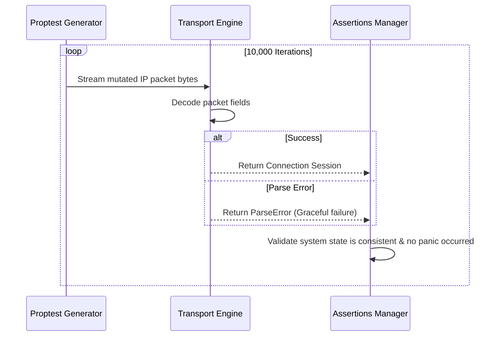

# 26_TESTING.md

> Project: Kizuna Network Inspector
>
> Parent:
> [00_MASTER_SPEC.md](file:///Users/andri/Documents/development.nosync/kizuna-network-inspector/docs/00_MASTER_SPEC.md)
>
> Version: 1.0
>
> Status: Draft
>
> Document Type:
> Testing Strategy Specification

---

## 1. Document Metadata

| Field | Value |
|---|---|
| Document | [26_TESTING.md](file:///Users/andri/Documents/development.nosync/kizuna-network-inspector/docs/26_TESTING.md) |
| Author | Kizuna Network Inspector QA Team |
| Version | 1.0.0-draft |
| Status | Draft |
| Target Platform | Testing Infrastructures |
| Last Updated | 2026-06-27 |

---

## 2. Purpose

This document defines the testing strategy, test classifications, coverage requirements, and automation frameworks for the Kizuna Network Inspector platform to ensure reliability and correct parsing.

---

## 3. Scope

### In-Scope
- Unit testing, Integration testing, and UI testing methodologies.
- Property-based testing for packet decoders.
- Automation pipeline testing runs.
- Target coverage matrices.

### Out-of-Scope
- External beta group testing plans or manual QA test scripts.

---

## 4. Definitions

- **Property Testing**: Testing software by declaring assertions that must hold true for any input generated by a testing framework (e.g. `proptest` in Rust).
- **Robolectric**: Unit testing framework for Android to run platform classes inside a local JVM environment.

---

## 5. Requirements

### Testing Goals

| Test Class | Objective | Tool / Framework | Target Coverage |
|---|---|---|---|
| **Unit Tests** | Verify business logic and algorithm correctness. | JUnit 5, `cargo test`, XCTest | `>= 80%` |
| **Integration Tests** | Validate database storage, API contracts, and stream parsing. | Room Testing, `cargo test` | `>= 70%` |
| **UI Tests** | Verify screen flow, navigation, and state rendering. | Compose UI Test, SwiftUI Test | `>= 50%` |
| **Property Tests** | Challenge parsers with random bytes to prevent crashes. | Rust `proptest` | Core Decoders |

---

## 6. Architecture (Test Harness Flow)

---

## 7. Automated Test Hierarchy

### 1. Rust Shared Core Test Suite
- Run `cargo test` to execute all parser validation tests.
- Fuzz testing: Stream raw byte mutations into `HTTPParser` to guarantee it fails gracefully without crashing or leaking memory.

### 2. Android App Test Suite
- Uses `MockK` for interface stubbing and `Turbine` to validate Kotlin Flow updates.
- Local SQLite database validation using in-memory Room database configurations.

### 3. iOS App Test Suite
- Validates Swift-to-Rust JNI/FFI binding layers using local XCTests.

---

## 8. Sequence Diagrams

### Fuzz & Property Test Sequence

---

## 9. Implementation Notes

- **Stubbing Strategy**: Avoid testing against live websites during automated runs. Use local HTTP mock servers (e.g. `mockwebserver` or Rust local servers) to guarantee deterministic network conditions.

---

## 10. Acceptance Criteria

- [ ] All automated tests pass successfully before merging pull requests.
- [ ] No regression bugs introduced during library upgrades or refactoring.
- [ ] Code coverage thresholds are met for all modified code files.
- [ ] Fuzz tests run for at least 5 minutes on CI without triggering panic errors.

---

## 11. Future Improvements

- **Local Simulator Tests**: Automated UI test runs using Android Emulators and iOS Simulators in headless mode.
- **Continuous Performance Tests**: Nightly benchmark runs to detect execution latency regressions.
