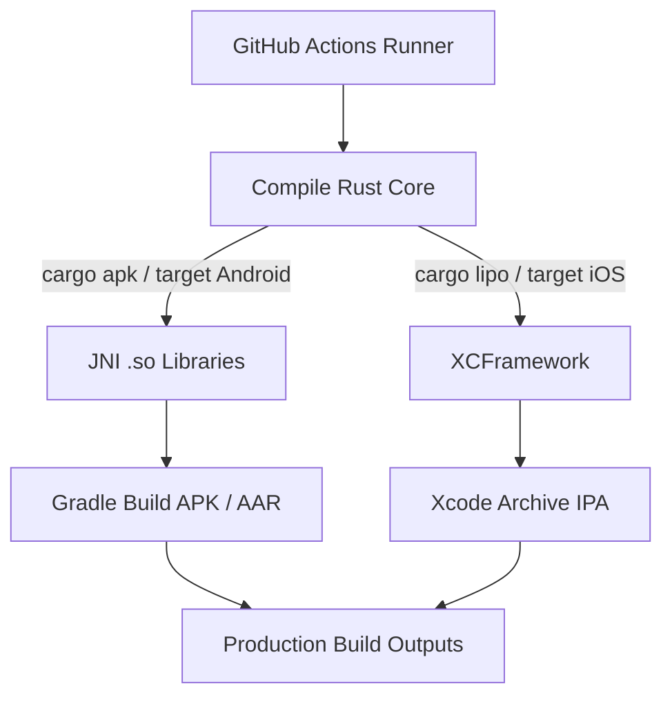
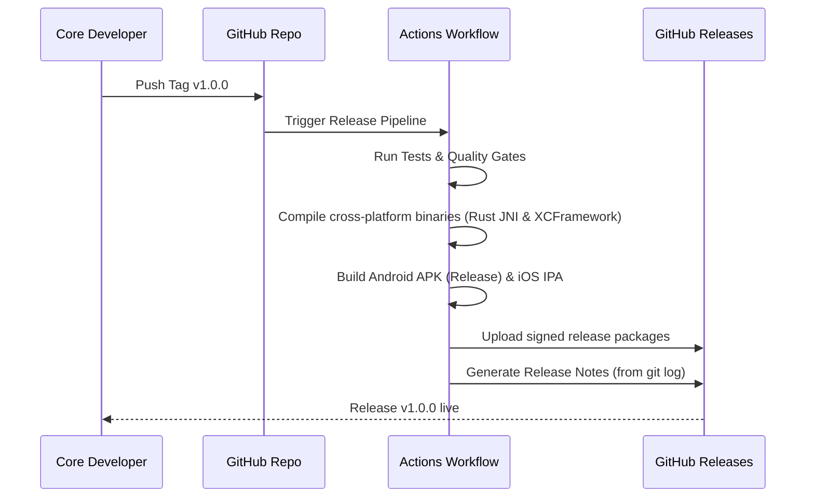
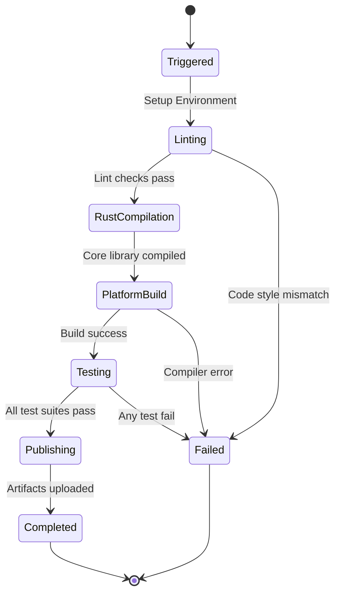

# 27_CI_CD.md

> Project: Kizuna Network Inspector
>
> Parent:
> [00_MASTER_SPEC.md](file:///Users/andri/Documents/development.nosync/kizuna-network-inspector/docs/00_MASTER_SPEC.md)
>
> Version: 1.0
>
> Status: Draft
>
> Document Type:
> CI/CD Architecture Specification

---

## 1. Document Metadata

| Field | Value |
|---|---|
| Document | [27_CI_CD.md](file:///Users/andri/Documents/development.nosync/kizuna-network-inspector/docs/27_CI_CD.md) |
| Author | Kizuna Network Inspector DevOps Team |
| Version | 1.0.0-draft |
| Status | Draft |
| Target Platform | CI/CD Infrastructure |
| Last Updated | 2026-06-27 |

---

## 2. Purpose

This document specifies the Continuous Integration (CI) and Continuous Deployment (CD) workflows, build validation pipelines, release versioning logic, and deployment targets for KNI.

---

## 3. Scope

### In-Scope
- GitHub Actions pipeline configurations.
- Multi-platform compiler rules (Rust target compilation for Android `aarch64`/`x86_64` and iOS platforms).
- Automated static analysis checks (Detekt, Clippy, SwiftLint).
- Release tagging procedures.

### Out-of-Scope
- App Store or Play Store review submission strategies.

---

## 4. Definitions

- **JNI (Java Native Interface)**: Native code binding bridging Java/Kotlin to Rust binaries (`.so`).
- **XCFramework**: Package format by Apple containing library binaries across iOS architectures (`.a`).

---

## 5. Requirements

### Pipeline Definitions

| Workflow | Trigger Event | Tasks Executed | Pass/Fail Criteria |
|---|---|---|---|
| **Pull Request Validation** | Pull Request to `develop` or `main` | Linting, cargo tests, Android unit tests, iOS unit tests. | Must pass all tasks before merging. |
| **Nightly Build** | Cron schedule (Daily 02:00 UTC) | Heavy property testing, coverage report generation, dependencies security scanning. | Report anomalies to Slack/Email. |
| **Release Deployment** | Git tag push (`v*`) | Compile production Rust core, bundle Android AAR/APKs, generate iOS XCFramework, publish to GitHub Releases. | Automated release note generation must complete. |

---

## 6. Architecture (Compilation Pipeline)

---

## 7. Static Analysis & Quality Gates

Every build must pass the following checks:
- **Rust**: `cargo fmt --check` and `cargo clippy -- -D warnings`.
- **Android**: `./gradlew lint` and `detekt`.
- **iOS**: `swiftlint`.

---

## 8. Sequence Diagrams

### Production Release Automation

---

## 9. State Diagrams

### Workflow Run Lifecycle

---

## 10. Implementation Notes

- **Docker Environment**: Android compilations run inside standard Ubuntu environments preloaded with NDK and SDK toolchains.
- **macOS Runners**: Apple builds (iOS XCFramework compilation) execute on macOS GitHub Actions runners.

---

## 11. Acceptance Criteria

- [ ] Every Pull Request requires a green pipeline pass before merging is unlocked.
- [ ] Compiling the Rust shared core supports all target mobile processor architectures.
- [ ] Build logs are organized and clear, facilitating troubleshooting of compile issues.
- [ ] Build artifacts (APKs/IPAs) are automatically cryptographically signed before release uploading.

---

## 12. Future Improvements

- **Self-Hosted Runner Infrastructure**: Migrating compilation steps to dedicated team servers to speed up build runs.
- **Auto-Submit to Stores**: Automatically push successful release builds to Google Play Internal Sharing and Apple TestFlight.
