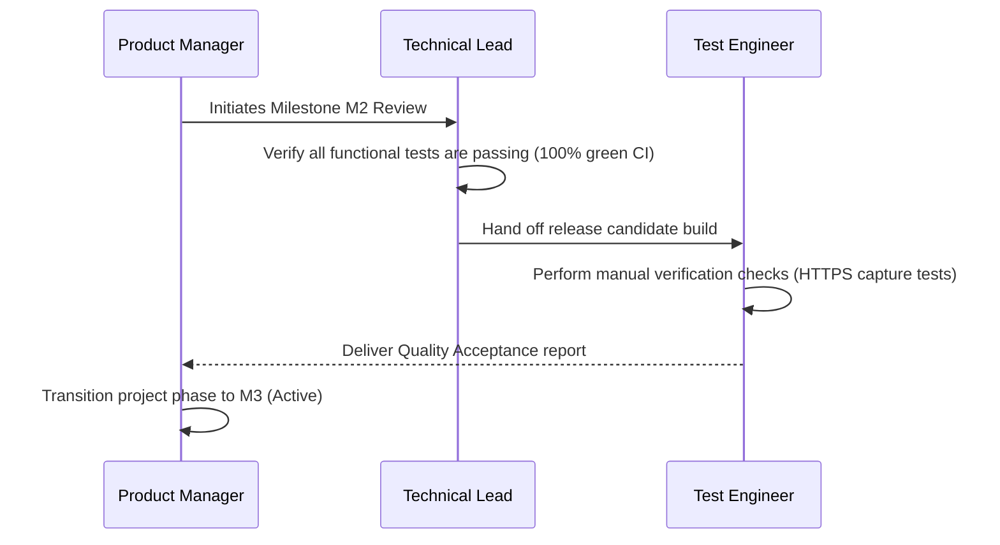
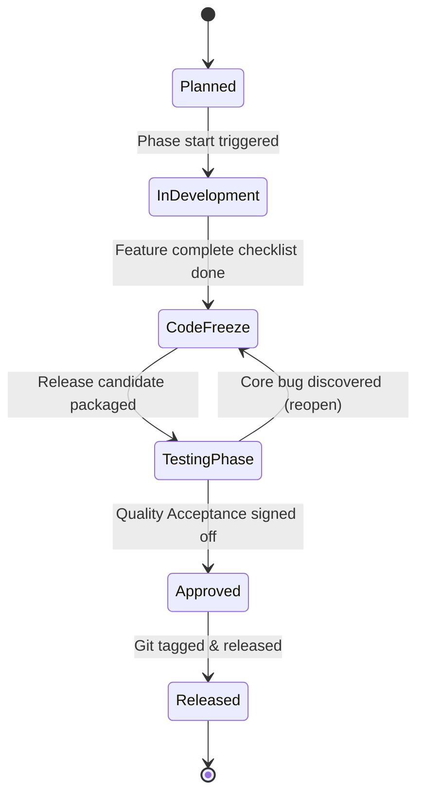

# 28_ROADMAP.md

> Project: Kizuna Network Inspector
>
> Parent:
> [00_MASTER_SPEC.md](file:///Users/andri/Documents/development.nosync/kizuna-network-inspector/docs/00_MASTER_SPEC.md)
>
> Version: 1.0
>
> Status: Draft
>
> Document Type:
> Roadmap & Milestones Specification

---

## 1. Document Metadata

| Field | Value |
|---|---|
| Document | [28_ROADMAP.md](file:///Users/andri/Documents/development.nosync/kizuna-network-inspector/docs/28_ROADMAP.md) |
| Author | Kizuna Network Inspector Management Team |
| Version | 1.0.0-draft |
| Status | Draft |
| Target Platform | Global Project Roadmap |
| Last Updated | 2026-06-27 |

---

## 2. Purpose

This document outlines the official development milestones, release timeline, feature phases, risk assessments, and resource distributions for KNI.

---

## 3. Scope

### In-Scope
- Phased milestones spanning from pre-alpha foundation to production 1.0 status.
- Feature deliverables per milestone.
- Risks mitigation models.

### Out-of-Scope
- Specific weekly developer task assignments.

---

## 4. Definitions

- **Alpha Phase**: Initial feature assembly. Code might contain core bugs; focus is on validating the VPN capture pipeline.
- **Beta Phase**: Feature-complete builds. Testing targets stability, decryption correctness, and UI polish.
- **GA (General Availability)**: Stable production release ready for standard developer usage.

---

## 5. Requirements

### Milestones Overview

| Milestone | Title | Focus Area | Deliverables | Estimated Target |
|---|---|---|---|---|
| **M1** | Foundation | Core VPN capture | <ul><li>[ ] Android VPNService setup</li><li>[ ] Plaintext TCP stream reassembly</li><li>[ ] SQLite database engine</li></ul> | Month 1 |
| **M2** | Decryption | HTTPS inspection | <ul><li>[ ] Local Root CA installation helper</li><li>[ ] Dynamic leaf certificate signing</li><li>[ ] Plaintext HTTP request parsing</li></ul> | Month 2 |
| **M3** | Utilities | Search & Filters | <ul><li>[ ] FTS5 query search</li><li>[ ] Domain capture filters</li><li>[ ] UI screen flow implementation</li></ul> | Month 3 |
| **M4** | Integration | Sharing & Export | <ul><li>[ ] cURL command generator</li><li>[ ] HAR 1.2 file exports</li><li>[ ] Integration tests</li></ul> | Month 4 |
| **M5** | Release (GA) | Stability | <ul><li>[ ] Performance optimizations</li><li>[ ] iOS VPN core validation</li><li>[ ] App store packages ready</li></ul> | Month 5 |

---

## 6. Development Pipeline (Timeline)

```mermaid
gantt
    title KNI Phase Roadmap
    dateFormat  X
    axisFormat %d
    section Development
    M1 - Foundation Core   :active, 0, 30
    M2 - HTTPS Decryption   :30, 60
    M3 - Search & Filters   :60, 90
    M4 - Exporter Tools     :90, 120
    M5 - GA Release Polish  :120, 150
```

---

## 7. Risks & Mitigation Strategies

### 1. OS Security Restraints
- **Risk**: Newer Android/iOS platforms continuously restrict local VPN permissions and custom Root certificate trust chains.
- **Mitigation**: Maintain a clear settings diagnostic checklist guide inside the client application to help developers establish trust chains safely.

### 2. High-Volume Packet Losses
- **Risk**: Capturing massive background network packet bursts might cause memory leaks or packet dropouts.
- **Mitigation**: Implement robust queue backpressure limits (discarding raw packet payload buffers rather than locking the JVM/Rust runtime).

---

## 8. Sequence Diagrams

### Milestone Phase Evaluation

---

## 9. State Diagrams

### Milestone Tracking States

---

## 10. Implementation Notes

- **Phased Rollouts**: Target pre-releases (Alpha/Beta) are distributed using internal platforms:
  - **Android**: Google Play Internal App Sharing / Firebase App Distribution.
  - **iOS**: Apple TestFlight invitation lists.

---

## 11. Acceptance Criteria

- [ ] Transitioning between milestone stages requires passing designated success criteria.
- [ ] No regression bugs in core features when moving to newer phase developments.
- [ ] Documentation is updated correspondingly after each milestone completion.

---

## 12. Future Improvements

- **Desktop Companion Integration**: Add roadmap stages for dedicated Windows/macOS desktop companion interfaces.
- **Platform Plugin SDK**: Plan features allowing community contributors to add custom protocol decoders.
