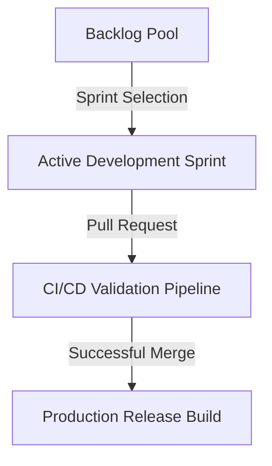
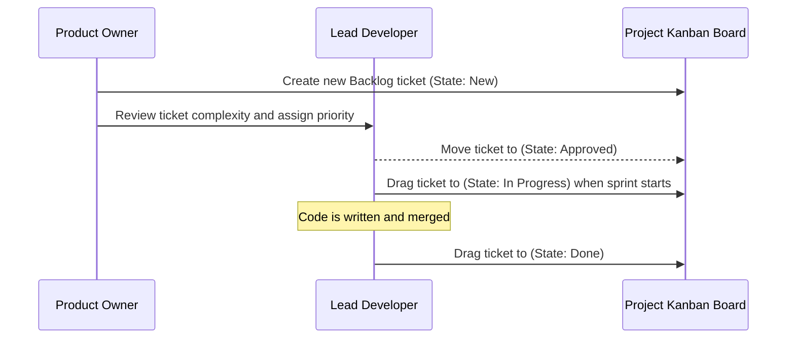
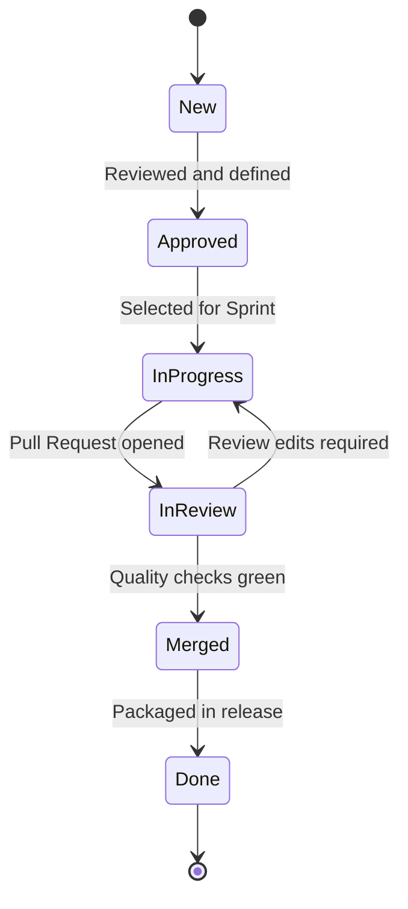

# 29_BACKLOG.md

> Project: Kizuna Network Inspector
>
> Parent:
> [00_MASTER_SPEC.md](file:///Users/andri/Documents/development.nosync/kizuna-network-inspector/docs/00_MASTER_SPEC.md)
>
> Version: 1.0
>
> Status: Draft
>
> Document Type:
> Project Backlog Specification

---

## 1. Document Metadata

| Field | Value |
|---|---|
| Document | [29_BACKLOG.md](file:///Users/andri/Documents/development.nosync/kizuna-network-inspector/docs/29_BACKLOG.md) |
| Author | Kizuna Network Inspector Core Team |
| Version | 1.0.0-draft |
| Status | Draft |
| Target Platform | Backlog Tracking |
| Last Updated | 2026-06-27 |

---

## 2. Purpose

This document represents the master product backlog of KNI. It tracks planned features, enhancements, optimizations, and technical debt items sorted by priority and mapped to target milestones.

---

## 3. Scope

### In-Scope
- List of backlog tickets containing titles, classifications, priorities, descriptions, and milestones.
- Lifecycle states of backlog items.

### Out-of-Scope
- Customer support bug reports (tracked in external issue trackers).

---

## 4. Definitions

- **Feature**: New application capabilities delivering value to developers.
- **Tech Debt**: Refactoring tasks to ensure code cleanups, library updates, or performance gains.
- **Chore**: Non-functional pipeline maintenance tasks (e.g. CI script updates).

---

## 5. Requirements

### Backlog Classifications

- **Critical**: Items required for immediate launch or foundation stability.
- **High**: Necessary elements to provide a polished developer tool.
- **Medium**: Planned additions.
- **Low**: Polish and styling enhancements.

---

## 6. Architecture (Task Flow)

---

## 7. Master Backlog List

| Task ID | Type | Priority | Title | Description | Target Milestone |
|---|---|---|---|---|---|
| **KNI-101** | Feature | Critical | Android VPN Capture Interface | Implement the Kotlin VPNService interface to read IP packets. | `M1 - Foundation` |
| **KNI-102** | Feature | Critical | TCP Stream Reassembly | Rebuild out-of-order IP payloads into unified TCP byte channels. | `M1 - Foundation` |
| **KNI-103** | Feature | Critical | Root CA trust generator | Establish local CA key generation using hardware-backed providers. | `M2 - Decryption` |
| **KNI-104** | Feature | High | SQLite FTS5 Indexing | Set up full-text search index matching on URL and Headers. | `M3 - Utilities` |
| **KNI-105** | Feature | High | HAR 1.2 Export Formatter | Implement the JSON serialization mapping to generate standard HAR files. | `M4 - Integration` |
| **KNI-106** | Tech Debt| Medium | Zero-Copy Parser optimization | Refactor Rust slice borrowings to minimize heap allocations. | `M5 - GA Release` |
| **KNI-107** | Feature | Low | Custom Color Theme Engine | Add Dracula and Solarized color palettes to Settings. | Future |

---

## 8. Sequence Diagrams

### Task Promotion Lifecycle

---

## 9. State Diagrams

### Backlog Item Lifecycle

---

## 10. Implementation Notes

- **Synchronization**: This markdown document is maintained alongside Git tags. Merged features are checked off or moved to the changelog.

---

## 11. Acceptance Criteria

- [ ] Every backlog ticket has a clear, actionable definition of done.
- [ ] Priorities are updated based on development milestones.
- [ ] No feature is built unless it corresponds to an approved backlog task.

---

## 12. Future Improvements

- **Auto-Sync to Jira/GitHub Issues**: Establish automated GitHub Actions to map this backlog file to GitHub Issues.
